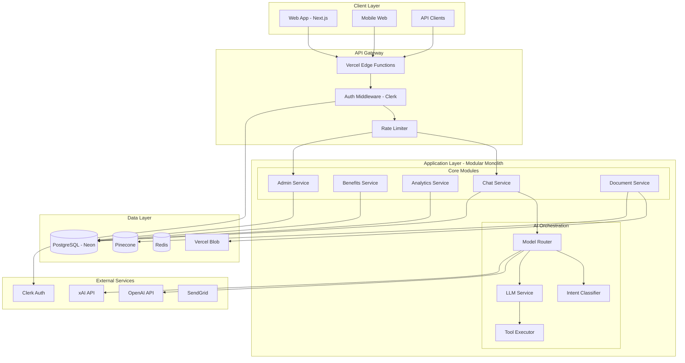

# System Architecture - Benefits Assistant Chatbot v2.0

## Architectural Decision Process

### Tree-of-Thought Analysis

#### Branch 1: Monolithic vs Microservices
**Option A: Monolithic Next.js Application**
- ✅ Pros: Simpler deployment, easier debugging, lower latency
- ❌ Cons: Harder to scale specific components, single point of failure

**Option B: Microservices Architecture**
- ✅ Pros: Independent scaling, fault isolation, technology flexibility
- ❌ Cons: Complex orchestration, network latency, operational overhead

**Option C: Modular Monolith** ⭐ SELECTED
- ✅ Pros: Monolith simplicity with service boundaries, easy to split later
- ✅ Pros: Clear module boundaries, independent development
- ✅ Pros: Can evolve to microservices when needed
- ❌ Cons: Requires discipline to maintain boundaries

**Decision**: Modular Monolith with clear service boundaries that can be extracted to microservices as scaling demands.

#### Branch 2: AI Model Architecture
**Option A: Single LLM for Everything**
- ✅ Pros: Simple, consistent responses
- ❌ Cons: Expensive, slower for simple queries

**Option B: Multi-Model with Router** ⭐ SELECTED
- ✅ Pros: Cost optimization, specialized models, fallback options
- ✅ Pros: Use smaller models for intent/classification
- ✅ Pros: Use larger models for complex reasoning
- ❌ Cons: More complex routing logic

**Option C: Fine-tuned Custom Model**
- ✅ Pros: Perfect for domain, potentially better performance
- ❌ Cons: High training cost, maintenance burden

**Decision**: Multi-model architecture with intelligent routing based on query complexity.

#### Branch 3: Data Storage Strategy
**Option A: Single PostgreSQL Database**
- ✅ Pros: ACID compliance, proven technology
- ❌ Cons: Limited for unstructured data, vector search

**Option B: Polyglot Persistence** ⭐ SELECTED
- ✅ Pros: Right tool for each job, optimal performance
- ✅ Pros: PostgreSQL for relational, Vector DB for search, Blob for files
- ✅ Pros: Redis for caching and sessions
- ❌ Cons: Multiple systems to maintain

**Option C: NoSQL Everything**
- ✅ Pros: Flexible schema, horizontal scaling
- ❌ Cons: No ACID, complex queries difficult

**Decision**: Polyglot persistence with PostgreSQL as primary, Pinecone for vectors, Redis for cache, Vercel Blob for files.

## High-Level Architecture



## Detailed Component Architecture

### 1. API Gateway Layer

```typescript
// middleware.ts - Edge-based routing and auth
import { authMiddleware } from '@clerk/nextjs';
import { rateLimiter } from '@/lib/rate-limit';
import { tenantResolver } from '@/lib/tenant';

export default authMiddleware({
  publicRoutes: ['/api/health', '/api/webhook/clerk'],
  
  afterAuth: async (auth, req) => {
    // Resolve tenant from auth
    const tenant = await tenantResolver(auth);
    
    // Apply rate limiting per tenant
    const rateLimitResult = await rateLimiter.check(
      tenant.id,
      req.headers.get('x-forwarded-for') || 'anonymous'
    );
    
    if (!rateLimitResult.success) {
      return new Response('Too Many Requests', { status: 429 });
    }
    
    // Inject tenant context
    req.headers.set('x-tenant-id', tenant.id);
    req.headers.set('x-user-role', auth.user.role);
  }
});

// Rate limiting configuration
export const rateLimiter = {
  chat: {
    provider_admin: { requests: 10000, window: '1h' },
    employer_admin: { requests: 1000, window: '1h' },
    employee: { requests: 100, window: '1h' }
  },
  api: {
    provider_admin: { requests: 50000, window: '1h' },
    employer_admin: { requests: 5000, window: '1h' },
    employee: { requests: 500, window: '1h' }
  }
};
```

### 2. Modular Application Architecture

```typescript
// lib/modules/chat/service.ts
export class ChatService {
  constructor(
    private db: Database,
    private ai: AIOrchestrator,
    private analytics: AnalyticsService,
    private benefits: BenefitsService
  ) {}
  
  async processMessage(
    message: string,
    context: ConversationContext
  ): Promise<ChatResponse> {
    // Log analytics event
    await this.analytics.track({
      event: 'message_received',
      userId: context.userId,
      companyId: context.companyId,
      sessionId: context.sessionId
    });
    
    // Route to appropriate AI model
    const response = await this.ai.process(message, context);
    
    // Execute tools if needed
    if (response.tools) {
      for (const tool of response.tools) {
        const result = await this.executeTool(tool, context);
        response.toolResults.push(result);
      }
    }
    
    // Save to database
    await this.saveMessage(context.chatId, message, response);
    
    return response;
  }
  
  private async executeTool(
    tool: ToolCall,
    context: ConversationContext
  ): Promise<ToolResult> {
    switch (tool.name) {
      case 'comparePlans':
        return this.benefits.comparePlans(tool.args, context);
      case 'calculateCost':
        return this.benefits.calculateCost(tool.args, context);
      case 'searchKnowledge':
        return this.benefits.searchKnowledge(tool.args, context);
      default:
        throw new Error(`Unknown tool: ${tool.name}`);
    }
  }
}
```

### 3. AI Orchestration Layer

```typescript
// lib/ai/orchestrator.ts
export class AIOrchestrator {
  private intentClassifier: IntentClassifier;
  private modelRouter: ModelRouter;
  private contextManager: ContextManager;
  
  async process(
    message: string,
    context: ConversationContext
  ): Promise<AIResponse> {
    // Classify intent with small model
    const intent = await this.intentClassifier.classify(message);
    
    // Determine model based on complexity
    const model = this.modelRouter.selectModel(intent);
    
    // Build enriched prompt with context
    const enrichedPrompt = await this.contextManager.buildPrompt(
      message,
      context,
      intent
    );
    
    // Execute with selected model
    const response = await model.complete(enrichedPrompt);
    
    // Post-process for quality
    return this.postProcess(response, intent);
  }
}

// Model routing logic
export class ModelRouter {
  selectModel(intent: Intent): AIModel {
    const complexity = this.calculateComplexity(intent);
    
    if (complexity < 0.3) {
      // Simple queries - use fast small model
      return new FastModel(); // GPT-3.5 or similar
    } else if (complexity < 0.7) {
      // Medium complexity - use balanced model
      return new BalancedModel(); // GPT-4-turbo
    } else {
      // Complex reasoning required
      return new AdvancedModel(); // GPT-4 or xAI Grok-2
    }
  }
  
  private calculateComplexity(intent: Intent): number {
    let score = 0;
    
    // Factors that increase complexity
    if (intent.requiresCalculation) score += 0.3;
    if (intent.requiresComparison) score += 0.2;
    if (intent.requiresPersonalization) score += 0.2;
    if (intent.multiStep) score += 0.3;
    if (intent.ambiguous) score += 0.2;
    
    return Math.min(score, 1.0);
  }
}
```

### 4. Data Access Layer

```typescript
// lib/db/repositories/benefits.repository.ts
export class BenefitsRepository {
  constructor(private db: DrizzleClient) {}
  
  async getPlansForCompany(
    companyId: string,
    filters?: PlanFilters
  ): Promise<BenefitPlan[]> {
    const query = this.db
      .select()
      .from(benefitPlan)
      .where(
        and(
          eq(benefitPlan.companyId, companyId),
          eq(benefitPlan.isActive, true),
          filters?.planType ? eq(benefitPlan.planType, filters.planType) : undefined
        )
      );
    
    return query.execute();
  }
  
  async upsertPlan(plan: NewBenefitPlan): Promise<BenefitPlan> {
    return this.db
      .insert(benefitPlan)
      .values(plan)
      .onConflictDoUpdate({
        target: [benefitPlan.companyId, benefitPlan.name],
        set: plan
      })
      .returning()
      .then(rows => rows[0]);
  }
}

// Repository pattern for clean architecture
export class RepositoryFactory {
  constructor(private db: DrizzleClient) {}
  
  get benefits() {
    return new BenefitsRepository(this.db);
  }
  
  get users() {
    return new UsersRepository(this.db);
  }
  
  get analytics() {
    return new AnalyticsRepository(this.db);
  }
  
  get knowledge() {
    return new KnowledgeRepository(this.db);
  }
}
```

### 5. Caching Strategy

```typescript
// lib/cache/strategy.ts
export class CacheStrategy {
  constructor(
    private redis: Redis,
    private config: CacheConfig
  ) {}
  
  // Multi-layer caching
  async get<T>(key: string): Promise<T | null> {
    // L1: In-memory cache (LRU)
    const memoryResult = this.memoryCache.get(key);
    if (memoryResult) return memoryResult;
    
    // L2: Redis cache
    const redisResult = await this.redis.get(key);
    if (redisResult) {
      const parsed = JSON.parse(redisResult);
      this.memoryCache.set(key, parsed);
      return parsed;
    }
    
    return null;
  }
  
  async set<T>(
    key: string,
    value: T,
    options?: CacheOptions
  ): Promise<void> {
    const ttl = options?.ttl || this.config.defaultTTL;
    
    // Write to both layers
    this.memoryCache.set(key, value, { ttl });
    await this.redis.setex(key, ttl, JSON.stringify(value));
    
    // Invalidate related keys if specified
    if (options?.invalidates) {
      await this.invalidate(options.invalidates);
    }
  }
  
  // Cache invalidation patterns
  async invalidate(patterns: string[]): Promise<void> {
    for (const pattern of patterns) {
      const keys = await this.redis.keys(pattern);
      if (keys.length > 0) {
        await this.redis.del(...keys);
      }
      this.memoryCache.clear(pattern);
    }
  }
}

// Cache configuration
export const cacheConfig = {
  benefits: {
    plans: { ttl: 3600, invalidates: ['benefits:*'] },
    calculations: { ttl: 300, invalidates: ['calc:*'] },
    comparisons: { ttl: 600, invalidates: ['compare:*'] }
  },
  knowledge: {
    search: { ttl: 1800, invalidates: ['knowledge:*'] },
    documents: { ttl: 3600, invalidates: ['docs:*'] }
  },
  analytics: {
    dashboard: { ttl: 60, invalidates: ['analytics:*'] },
    reports: { ttl: 300, invalidates: ['reports:*'] }
  }
};
```

### 6. Event-Driven Architecture

```typescript
// lib/events/system.ts
export class EventBus {
  private handlers: Map<string, EventHandler[]> = new Map();
  
  on(event: string, handler: EventHandler): void {
    const handlers = this.handlers.get(event) || [];
    handlers.push(handler);
    this.handlers.set(event, handlers);
  }
  
  async emit(event: string, data: any): Promise<void> {
    const handlers = this.handlers.get(event) || [];
    
    // Execute handlers in parallel with error isolation
    await Promise.allSettled(
      handlers.map(handler => 
        handler(data).catch(error => 
          console.error(`Error in handler for ${event}:`, error)
        )
      )
    );
  }
}

// Event definitions
export const events = {
  // User events
  USER_CREATED: 'user.created',
  USER_LOGGED_IN: 'user.logged_in',
  
  // Benefits events
  PLAN_UPDATED: 'benefits.plan_updated',
  ENROLLMENT_STARTED: 'benefits.enrollment_started',
  
  // AI events
  CHAT_STARTED: 'ai.chat_started',
  TOOL_EXECUTED: 'ai.tool_executed',
  LOW_CONFIDENCE: 'ai.low_confidence',
  
  // Analytics events
  METRIC_THRESHOLD: 'analytics.metric_threshold',
  REPORT_GENERATED: 'analytics.report_generated'
};

// Event handlers
eventBus.on(events.PLAN_UPDATED, async (data) => {
  // Invalidate caches
  await cache.invalidate([`benefits:${data.companyId}:*`]);
  
  // Reindex for search
  await vectorStore.reindexPlan(data.planId);
  
  // Notify affected users
  await notificationService.notifyPlanUpdate(data);
});
```

### 7. Security Architecture

```typescript
// lib/security/layers.ts
export class SecurityManager {
  // Request validation
  async validateRequest(req: Request): Promise<ValidationResult> {
    // Input sanitization
    const sanitized = this.sanitizeInput(req.body);
    
    // CSRF protection
    const csrfValid = await this.validateCSRF(req);
    
    // Rate limiting check
    const rateLimitOk = await this.checkRateLimit(req);
    
    // SQL injection prevention (handled by Drizzle ORM)
    // XSS prevention (handled by React)
    
    return {
      valid: csrfValid && rateLimitOk,
      sanitizedData: sanitized
    };
  }
  
  // Data encryption
  async encryptSensitive(data: any): Promise<string> {
    const key = await this.getEncryptionKey();
    return encrypt(JSON.stringify(data), key);
  }
  
  // Access control
  async authorize(
    user: User,
    resource: string,
    action: string
  ): Promise<boolean> {
    const permissions = await this.getUserPermissions(user);
    return permissions.includes(`${resource}:${action}`);
  }
}

// Security headers
export const securityHeaders = {
  'Content-Security-Policy': 
    "default-src 'self'; script-src 'self' 'unsafe-inline' 'unsafe-eval' https://vercel.live; " +
    "style-src 'self' 'unsafe-inline'; img-src 'self' data: https:; " +
    "connect-src 'self' https://api.openai.com https://api.anthropic.com;",
  'X-Frame-Options': 'DENY',
  'X-Content-Type-Options': 'nosniff',
  'Referrer-Policy': 'strict-origin-when-cross-origin',
  'Permissions-Policy': 'camera=(), microphone=(), geolocation=()'
};
```

### 8. Monitoring & Observability

```typescript
// lib/monitoring/telemetry.ts
import { trace, context, SpanStatusCode } from '@opentelemetry/api';

export class Telemetry {
  private tracer = trace.getTracer('benefits-assistant');
  
  async traceOperation<T>(
    name: string,
    operation: () => Promise<T>,
    attributes?: Record<string, any>
  ): Promise<T> {
    const span = this.tracer.startSpan(name);
    
    try {
      // Add attributes
      if (attributes) {
        Object.entries(attributes).forEach(([key, value]) => {
          span.setAttribute(key, value);
        });
      }
      
      // Execute operation
      const result = await operation();
      
      span.setStatus({ code: SpanStatusCode.OK });
      return result;
    } catch (error) {
      span.setStatus({
        code: SpanStatusCode.ERROR,
        message: error.message
      });
      span.recordException(error);
      throw error;
    } finally {
      span.end();
    }
  }
}

// Metrics collection
export class Metrics {
  // Business metrics
  recordChatSession(session: ChatSession): void {
    metrics.increment('chat.sessions.total', {
      company: session.companyId,
      user_type: session.userType
    });
    
    metrics.histogram('chat.session.duration', session.duration, {
      company: session.companyId
    });
    
    metrics.gauge('chat.satisfaction.score', session.satisfaction || 0, {
      company: session.companyId
    });
  }
  
  // Technical metrics
  recordAPICall(endpoint: string, duration: number, status: number): void {
    metrics.histogram('api.request.duration', duration, {
      endpoint,
      status: status.toString()
    });
    
    if (status >= 500) {
      metrics.increment('api.errors.5xx', { endpoint });
    }
  }
}
```

### 9. Deployment Architecture

```yaml
# vercel.json
{
  "buildCommand": "pnpm run build",
  "devCommand": "pnpm run dev",
  "installCommand": "pnpm install",
  "framework": "nextjs",
  
  "functions": {
    "app/api/chat/route.ts": {
      "maxDuration": 30,
      "memory": 1024,
      "runtime": "nodejs20.x"
    },
    "app/api/admin/*": {
      "maxDuration": 10,
      "memory": 512
    },
    "app/api/analytics/*": {
      "maxDuration": 15,
      "memory": 768
    }
  },
  
  "crons": [
    {
      "path": "/api/cron/analytics",
      "schedule": "0 */6 * * *"
    },
    {
      "path": "/api/cron/cleanup",
      "schedule": "0 2 * * *"
    }
  ],
  
  "env": {
    "ENABLE_EXPERIMENTAL_COREPACK": "1"
  },
  
  "regions": ["iad1", "sfo1"],
  
  "headers": [
    {
      "source": "/api/(.*)",
      "headers": [
        {
          "key": "Cache-Control",
          "value": "no-store, max-age=0"
        }
      ]
    }
  ]
}
```

### 10. Disaster Recovery Architecture

```typescript
// lib/backup/strategy.ts
export class BackupStrategy {
  async performBackup(): Promise<BackupResult> {
    const timestamp = new Date().toISOString();
    
    // Database backup
    const dbBackup = await this.backupDatabase(timestamp);
    
    // File storage backup
    const fileBackup = await this.backupFiles(timestamp);
    
    // Configuration backup
    const configBackup = await this.backupConfiguration(timestamp);
    
    // Verify backup integrity
    const verified = await this.verifyBackup({
      database: dbBackup,
      files: fileBackup,
      config: configBackup
    });
    
    return {
      timestamp,
      status: verified ? 'success' : 'failed',
      components: { dbBackup, fileBackup, configBackup }
    };
  }
  
  async restore(backupId: string): Promise<RestoreResult> {
    // Implement point-in-time recovery
    const backup = await this.getBackup(backupId);
    
    // Restore in correct order
    await this.restoreDatabase(backup.database);
    await this.restoreFiles(backup.files);
    await this.restoreConfiguration(backup.config);
    
    // Verify restoration
    return this.verifyRestore();
  }
}
```

## Scalability Considerations

### Horizontal Scaling Strategy
1. **Stateless Application Servers**: All state in external stores
2. **Database Read Replicas**: For read-heavy operations
3. **CDN Integration**: For static assets and cached responses
4. **Auto-scaling Rules**: Based on CPU, memory, and request rate

### Vertical Scaling Strategy
1. **Database Connection Pooling**: Optimize connection usage
2. **Query Optimization**: Indexes and query planning
3. **Caching Layers**: Reduce database load
4. **Async Processing**: Queue heavy operations

### Performance Optimization
1. **Code Splitting**: Lazy load features
2. **Image Optimization**: Next.js Image component
3. **API Response Compression**: Gzip/Brotli
4. **Database Query Optimization**: Explain analyze

## Future Architecture Evolution

### Phase 1: Current State (Modular Monolith)
- Single Next.js application
- Clear module boundaries
- Shared database
- Synchronous communication

### Phase 2: Service Extraction (6 months)
- Extract document processing service
- Extract analytics service
- Message queue introduction
- API gateway implementation

### Phase 3: Full Microservices (12 months)
- Independent deployments
- Service mesh (Istio/Linkerd)
- Distributed tracing
- Container orchestration (K8s)

### Phase 4: Global Scale (18 months)
- Multi-region deployment
- Edge computing for chat
- Global CDN integration
- Eventual consistency model

This architecture provides a solid foundation that can scale from startup to enterprise while maintaining development velocity and system reliability.