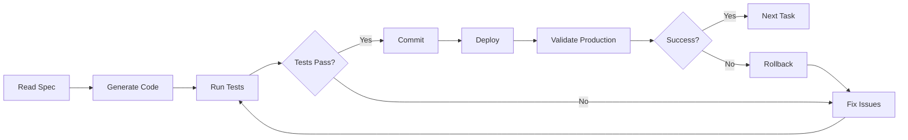

# Claude Code MCP Execution System - Benefits Assistant Chatbot v2.0

## Overview

This document serves as the systematic execution guide for Claude Code MCP to implement the Benefits Assistant Chatbot v2.0 without fail. It provides step-by-step instructions, validation checks, and recovery procedures for each development phase.

## System Requirements

### Pre-Development Checklist
```bash
# Verify environment
node --version # Must be >= 20.0.0
pnpm --version # Must be >= 8.0.0
git --version  # Must be >= 2.30.0

# Verify services
echo $POSTGRES_URL # Must be set
echo $AUTH_SECRET  # Must be set
echo $OPENAI_API_KEY # Must be set for Phase 1

# Verify repository state
git status # Must be clean
git branch # Must be on main
```

## Execution Framework

### Core Principles
1. **Incremental Development**: Never make breaking changes
2. **Continuous Validation**: Test after every change
3. **Rollback Capability**: Maintain ability to revert
4. **Documentation**: Update docs with code
5. **Type Safety**: No `any` types without TODO

### Development Cycle


## Phase 1 Execution: Data Foundation & Enhanced Employee Experience

### Week 1: Database Schema & Data Management

#### Task 1.1.1: Create Multi-Tenant Schema
```bash
# Step 1: Generate migration files
pnpm drizzle-kit generate

# Step 2: Create schema file
cat > lib/db/schema-v2.ts << 'EOF'
import { pgTable, varchar, timestamp, json, uuid, text, boolean, integer, index } from 'drizzle-orm/pg-core';

// Company table
export const company = pgTable('Company', {
  id: uuid('id').primaryKey().notNull().defaultRandom(),
  name: varchar('name', { length: 255 }).notNull(),
  domain: varchar('domain', { length: 255 }).unique(),
  ssoProvider: varchar('ssoProvider', { length: 20 }),
  settings: json('settings').notNull().default({}),
  createdAt: timestamp('createdAt').notNull().defaultNow(),
  updatedAt: timestamp('updatedAt').notNull().defaultNow(),
  status: varchar('status', { length: 20 }).default('active')
}, (table) => ({
  domainIdx: index('idx_company_domain').on(table.domain),
}));

// UserRole table
export const userRole = pgTable('UserRole', {
  id: uuid('id').primaryKey().notNull().defaultRandom(),
  userId: uuid('userId').notNull().references(() => user.id),
  companyId: uuid('companyId').references(() => company.id),
  role: varchar('role', { length: 20 }).notNull(),
  permissions: json('permissions').notNull().default([]),
  createdAt: timestamp('createdAt').notNull().defaultNow()
}, (table) => ({
  userCompanyIdx: index('idx_user_company').on(table.userId, table.companyId),
}));

// BenefitPlan table
export const benefitPlan = pgTable('BenefitPlan', {
  id: uuid('id').primaryKey().notNull().defaultRandom(),
  companyId: uuid('companyId').notNull().references(() => company.id),
  planType: varchar('planType', { length: 20 }).notNull(),
  name: varchar('name', { length: 255 }).notNull(),
  insuranceType: varchar('insuranceType', { length: 50 }),
  monthlyPremium: json('monthlyPremium').notNull(),
  deductible: json('deductible').notNull(),
  outOfPocketMax: json('outOfPocketMax').notNull(),
  copays: json('copays').notNull(),
  coinsurance: integer('coinsurance'),
  networkSize: varchar('networkSize', { length: 20 }),
  features: json('features').notNull().default([]),
  metadata: json('metadata').notNull().default({}),
  effectiveDate: timestamp('effectiveDate').notNull(),
  expirationDate: timestamp('expirationDate'),
  isActive: boolean('isActive').default(true)
}, (table) => ({
  companyPlanTypeIdx: index('idx_company_plan_type').on(table.companyId, table.planType),
}));

// Export all tables
export * from './schema'; // Include existing tables
EOF

# Step 3: Validate schema
pnpm exec tsx -e "
import { company, userRole, benefitPlan } from './lib/db/schema-v2';
console.log('Schema validation passed');
"

# Step 4: Generate migration
pnpm drizzle-kit generate

# Step 5: Run migration
pnpm db:migrate

# Validation checkpoint
if [ $? -eq 0 ]; then
  echo "✅ Schema migration successful"
else
  echo "❌ Schema migration failed"
  exit 1
fi
```

#### Task 1.1.2: Implement Repository Layer
```typescript
// lib/db/repositories/base.repository.ts
import { drizzle } from 'drizzle-orm/postgres-js';
import postgres from 'postgres';

export abstract class BaseRepository<T> {
  protected db: ReturnType<typeof drizzle>;
  
  constructor(connectionString: string) {
    const client = postgres(connectionString);
    this.db = drizzle(client);
  }
  
  abstract findById(id: string): Promise<T | null>;
  abstract findAll(filters?: any): Promise<T[]>;
  abstract create(data: Partial<T>): Promise<T>;
  abstract update(id: string, data: Partial<T>): Promise<T>;
  abstract delete(id: string): Promise<boolean>;
}

// lib/db/repositories/benefits.repository.ts
import { eq, and } from 'drizzle-orm';
import { benefitPlan } from '../schema-v2';
import { BaseRepository } from './base.repository';

export class BenefitsRepository extends BaseRepository<BenefitPlan> {
  async findById(id: string) {
    const [plan] = await this.db
      .select()
      .from(benefitPlan)
      .where(eq(benefitPlan.id, id));
    return plan || null;
  }
  
  async findByCompany(companyId: string, filters?: PlanFilters) {
    let query = this.db
      .select()
      .from(benefitPlan)
      .where(
        and(
          eq(benefitPlan.companyId, companyId),
          eq(benefitPlan.isActive, true)
        )
      );
    
    if (filters?.planType) {
      query = query.where(eq(benefitPlan.planType, filters.planType));
    }
    
    return query.execute();
  }
  
  async create(data: NewBenefitPlan) {
    const [created] = await this.db
      .insert(benefitPlan)
      .values(data)
      .returning();
    return created;
  }
  
  async update(id: string, data: Partial<BenefitPlan>) {
    const [updated] = await this.db
      .update(benefitPlan)
      .set({ ...data, updatedAt: new Date() })
      .where(eq(benefitPlan.id, id))
      .returning();
    return updated;
  }
  
  async delete(id: string) {
    const result = await this.db
      .delete(benefitPlan)
      .where(eq(benefitPlan.id, id));
    return result.rowCount > 0;
  }
}

// Validation test
const repo = new BenefitsRepository(process.env.POSTGRES_URL!);
const testPlan = await repo.create({
  companyId: 'test-company-id',
  planType: 'health',
  name: 'Test Plan',
  // ... other required fields
});
console.assert(testPlan.id, 'Repository test failed');
```

#### Task 1.1.3: Create Migration Scripts
```typescript
// scripts/migrate-to-multi-tenant.ts
import { drizzle } from 'drizzle-orm/postgres-js';
import postgres from 'postgres';
import { user, chat, message } from '../lib/db/schema';
import { company, userRole } from '../lib/db/schema-v2';

async function migrateToMultiTenant() {
  const client = postgres(process.env.POSTGRES_URL!);
  const db = drizzle(client);
  
  console.log('Starting multi-tenant migration...');
  
  try {
    // Step 1: Create default company
    const [defaultCompany] = await db
      .insert(company)
      .values({
        name: 'Default Company',
        domain: 'default.com',
        settings: {}
      })
      .returning();
    
    console.log(`Created default company: ${defaultCompany.id}`);
    
    // Step 2: Add companyId to existing users
    const users = await db.select().from(user);
    
    for (const u of users) {
      // Create user role
      await db.insert(userRole).values({
        userId: u.id,
        companyId: defaultCompany.id,
        role: 'employee',
        permissions: []
      });
    }
    
    console.log(`Migrated ${users.length} users`);
    
    // Step 3: Update chats with companyId
    await db.execute(`
      ALTER TABLE "Chat" 
      ADD COLUMN IF NOT EXISTS "companyId" UUID 
      REFERENCES "Company"(id) 
      DEFAULT '${defaultCompany.id}'
    `);
    
    console.log('Migration completed successfully');
    process.exit(0);
  } catch (error) {
    console.error('Migration failed:', error);
    process.exit(1);
  }
}

// Run migration
migrateToMultiTenant();
```

### Week 2: Real Data Integration

#### Task 1.2.1: Update AI Tools with Database Integration
```typescript
// lib/ai/tools/compare-benefits-plans.ts
import { tool } from 'ai';
import { z } from 'zod';
import { BenefitsRepository } from '@/lib/db/repositories/benefits.repository';

export const comparePlans = tool({
  description: "Compare health insurance plans with real data",
  inputSchema: z.object({
    planType: z.enum(['health', 'dental', 'vision', 'life', 'disability']),
    companyId: z.string().uuid(),
    userProfile: z.object({
      familySize: z.number().optional(),
      age: z.number().optional(),
      expectedUsage: z.enum(['low', 'moderate', 'high']).optional()
    }).optional()
  }),
  execute: async ({ planType, companyId, userProfile }) => {
    const repo = new BenefitsRepository(process.env.POSTGRES_URL!);
    
    // Fetch real plans from database
    const plans = await repo.findByCompany(companyId, { planType });
    
    if (plans.length === 0) {
      throw new Error(`No ${planType} plans found for company`);
    }
    
    // Calculate personalized scores
    const scoredPlans = plans.map(plan => {
      const score = calculatePlanScore(plan, userProfile);
      const annualCost = calculateAnnualCost(plan, userProfile);
      
      return {
        ...plan,
        score,
        annualCost,
        recommendation: generateRecommendation(plan, userProfile, score)
      };
    });
    
    // Sort by best match
    scoredPlans.sort((a, b) => b.score - a.score);
    
    return {
      plans: scoredPlans.slice(0, 4), // Max 4 plans
      bestMatch: scoredPlans[0],
      savingsOpportunity: calculateSavingsOpportunity(scoredPlans)
    };
  }
});

// Helper functions
function calculatePlanScore(plan: BenefitPlan, profile?: UserProfile): number {
  let score = 50; // Base score
  
  if (profile?.expectedUsage === 'low' && plan.monthlyPremium.single < 400) {
    score += 20;
  }
  
  if (profile?.expectedUsage === 'high' && plan.deductible.single < 1000) {
    score += 20;
  }
  
  if (profile?.familySize > 1 && plan.monthlyPremium.family < 1200) {
    score += 10;
  }
  
  return Math.min(score, 100);
}

function calculateAnnualCost(plan: BenefitPlan, profile?: UserProfile): number {
  const premium = profile?.familySize > 1 
    ? plan.monthlyPremium.family 
    : plan.monthlyPremium.single;
  
  const annualPremium = premium * 12;
  const estimatedOutOfPocket = estimateOutOfPocket(plan, profile);
  
  return annualPremium + estimatedOutOfPocket;
}

// Validation test
const result = await comparePlans.execute({
  planType: 'health',
  companyId: 'test-company-id',
  userProfile: { familySize: 4, expectedUsage: 'moderate' }
});
console.assert(result.plans.length > 0, 'Tool integration test failed');
```

#### Task 1.2.2: Context-Aware AI Implementation
```typescript
// lib/ai/context-manager.ts
import { auth } from '@/app/(auth)/auth';
import { CompanyRepository } from '@/lib/db/repositories/company.repository';
import { UserRepository } from '@/lib/db/repositories/user.repository';

export class ContextManager {
  private companyRepo: CompanyRepository;
  private userRepo: UserRepository;
  
  constructor() {
    this.companyRepo = new CompanyRepository(process.env.POSTGRES_URL!);
    this.userRepo = new UserRepository(process.env.POSTGRES_URL!);
  }
  
  async buildContext(sessionId: string): Promise<ConversationContext> {
    const session = await auth();
    if (!session?.user) {
      throw new Error('Unauthorized');
    }
    
    const userProfile = await this.userRepo.findById(session.user.id);
    const company = await this.companyRepo.findById(userProfile.companyId);
    const availablePlans = await this.getAvailablePlans(company.id);
    
    return {
      userId: session.user.id,
      companyId: company.id,
      companyName: company.name,
      userRole: userProfile.role,
      sessionId,
      availablePlans: availablePlans.map(p => ({
        id: p.id,
        name: p.name,
        type: p.planType
      })),
      enrollmentDates: this.getEnrollmentDates(company),
      userMetadata: {
        department: userProfile.department,
        location: userProfile.location,
        familySize: userProfile.familySize
      }
    };
  }
  
  private async getAvailablePlans(companyId: string) {
    const benefitsRepo = new BenefitsRepository(process.env.POSTGRES_URL!);
    return benefitsRepo.findByCompany(companyId);
  }
  
  private getEnrollmentDates(company: Company) {
    const settings = company.settings as CompanySettings;
    return {
      start: settings.enrollmentStart || null,
      end: settings.enrollmentEnd || null,
      isOpen: this.isEnrollmentOpen(settings)
    };
  }
  
  private isEnrollmentOpen(settings: CompanySettings): boolean {
    if (!settings.enrollmentStart || !settings.enrollmentEnd) {
      return false;
    }
    
    const now = new Date();
    return now >= new Date(settings.enrollmentStart) && 
           now <= new Date(settings.enrollmentEnd);
  }
}

// Update system prompt with context
export function buildContextualPrompt(context: ConversationContext): string {
  return `
You are a benefits advisor for ${context.companyName} employees.

Company Context:
- Available Plans: ${context.availablePlans.map(p => `${p.name} (${p.type})`).join(', ')}
- Enrollment Period: ${context.enrollmentDates.isOpen ? 'OPEN' : 'CLOSED'}
  ${context.enrollmentDates.end ? `- Ends: ${context.enrollmentDates.end}` : ''}

User Context:
- Department: ${context.userMetadata.department}
- Location: ${context.userMetadata.location}
- Family Size: ${context.userMetadata.familySize || 'Unknown'}

Always reference specific plan names and company policies when answering questions.
`;
}
```

### Validation Framework

#### Continuous Integration Checks
```yaml
# .github/workflows/validate.yml
name: Validation Pipeline

on:
  push:
    branches: [main]
  pull_request:

jobs:
  validate:
    runs-on: ubuntu-latest
    
    steps:
      - uses: actions/checkout@v3
      
      - name: Setup Node
        uses: actions/setup-node@v3
        with:
          node-version: '20'
          
      - name: Install dependencies
        run: pnpm install
        
      - name: Type check
        run: pnpm tsc --noEmit
        
      - name: Lint
        run: pnpm lint
        
      - name: Test
        run: pnpm test
        
      - name: Build
        run: pnpm build
        
      - name: Database validation
        env:
          POSTGRES_URL: ${{ secrets.POSTGRES_URL }}
        run: |
          pnpm db:push --dry-run
          pnpm exec tsx scripts/validate-schema.ts
```

#### Schema Validation Script
```typescript
// scripts/validate-schema.ts
import { drizzle } from 'drizzle-orm/postgres-js';
import postgres from 'postgres';
import { sql } from 'drizzle-orm';

async function validateSchema() {
  const client = postgres(process.env.POSTGRES_URL!);
  const db = drizzle(client);
  
  const checks = [
    {
      name: 'Company table exists',
      query: sql`SELECT EXISTS (
        SELECT FROM information_schema.tables 
        WHERE table_name = 'Company'
      )`
    },
    {
      name: 'UserRole table exists',
      query: sql`SELECT EXISTS (
        SELECT FROM information_schema.tables 
        WHERE table_name = 'UserRole'
      )`
    },
    {
      name: 'BenefitPlan table exists',
      query: sql`SELECT EXISTS (
        SELECT FROM information_schema.tables 
        WHERE table_name = 'BenefitPlan'
      )`
    },
    {
      name: 'Foreign keys are valid',
      query: sql`SELECT COUNT(*) FROM information_schema.table_constraints 
                 WHERE constraint_type = 'FOREIGN KEY'`
    }
  ];
  
  console.log('Running schema validation...\n');
  
  for (const check of checks) {
    try {
      const result = await db.execute(check.query);
      console.log(`✅ ${check.name}`);
    } catch (error) {
      console.error(`❌ ${check.name}: ${error.message}`);
      process.exit(1);
    }
  }
  
  console.log('\n✅ All schema validations passed');
  process.exit(0);
}

validateSchema();
```

## Recovery Procedures

### Rollback Strategy
```bash
# 1. Identify the issue
git log --oneline -10

# 2. Create a backup branch
git checkout -b backup-current-state

# 3. Rollback to last known good commit
git checkout main
git reset --hard <last-good-commit>

# 4. Force push if necessary (be careful!)
git push --force-with-lease origin main

# 5. Rollback database migration
pnpm exec tsx -e "
import { db } from './lib/db';
await db.execute('DROP TABLE IF EXISTS \"NewTable\" CASCADE');
"

# 6. Restore from database backup if needed
pg_restore -h $DB_HOST -U $DB_USER -d $DB_NAME backup.sql
```

### Common Issues & Solutions

#### Issue: Migration Fails
```typescript
// Recovery script: scripts/fix-migration.ts
async function fixMigration() {
  try {
    // 1. Check current state
    const tables = await db.execute(sql`
      SELECT table_name FROM information_schema.tables 
      WHERE table_schema = 'public'
    `);
    
    // 2. Identify missing migrations
    const migrations = await db.select().from('__drizzle_migrations');
    
    // 3. Apply missing migrations manually
    for (const migration of pendingMigrations) {
      await db.execute(migration.sql);
      await db.insert('__drizzle_migrations').values({
        hash: migration.hash,
        created_at: new Date()
      });
    }
  } catch (error) {
    console.error('Fix failed:', error);
    // Restore from backup
    await restoreFromBackup();
  }
}
```

#### Issue: Type Errors
```typescript
// Type fixing utility
export type FixMe = any; // Temporary type with TODO

// Usage in code
const data: FixMe = await fetchData(); // TODO: Define proper type

// Gradual type improvement
interface ProperType {
  id: string;
  // ... other fields
}
const typedData = data as ProperType; // Gradual migration
```

#### Issue: Performance Degradation
```typescript
// Performance monitoring
import { performance } from 'perf_hooks';

export function measurePerformance<T>(
  name: string,
  fn: () => Promise<T>
): Promise<T> {
  const start = performance.now();
  
  return fn().finally(() => {
    const duration = performance.now() - start;
    
    if (duration > 1000) {
      console.warn(`⚠️  ${name} took ${duration}ms`);
      
      // Auto-create optimization task
      createOptimizationTask({
        function: name,
        duration,
        timestamp: new Date()
      });
    }
  });
}
```

## Automated Testing Framework

### Test Structure
```typescript
// __tests__/phase1/schema.test.ts
import { describe, it, expect, beforeAll } from 'vitest';
import { setupTestDb, cleanupTestDb } from '../test-utils';

describe('Phase 1: Database Schema', () => {
  beforeAll(async () => {
    await setupTestDb();
  });
  
  afterAll(async () => {
    await cleanupTestDb();
  });
  
  it('should create company with correct fields', async () => {
    const company = await db.insert(company).values({
      name: 'Test Company',
      domain: 'test.com'
    }).returning();
    
    expect(company[0]).toMatchObject({
      id: expect.any(String),
      name: 'Test Company',
      domain: 'test.com',
      status: 'active'
    });
  });
  
  it('should enforce tenant isolation', async () => {
    // Test that Company A cannot access Company B data
    const companyA = await createTestCompany('A');
    const companyB = await createTestCompany('B');
    
    const planA = await createTestPlan(companyA.id);
    const planB = await createTestPlan(companyB.id);
    
    // Attempt cross-tenant access
    const plans = await getPlansForCompany(companyA.id);
    
    expect(plans).toContainEqual(planA);
    expect(plans).not.toContainEqual(planB);
  });
});
```

### Integration Tests
```typescript
// __tests__/integration/ai-tools.test.ts
describe('AI Tools Integration', () => {
  it('should return real data from comparePlans', async () => {
    // Setup test data
    const company = await createTestCompany();
    const plans = await createTestPlans(company.id, 3);
    
    // Execute tool
    const result = await comparePlans.execute({
      planType: 'health',
      companyId: company.id,
      userProfile: {
        familySize: 4,
        expectedUsage: 'moderate'
      }
    });
    
    // Validate
    expect(result.plans).toHaveLength(3);
    expect(result.bestMatch).toBeDefined();
    expect(result.plans[0].score).toBeGreaterThan(0);
    
    // Verify calculations
    const manualCalc = calculateAnnualCost(plans[0], { familySize: 4 });
    expect(result.plans[0].annualCost).toBe(manualCalc);
  });
});
```

## Progress Tracking

### Daily Standup Template
```markdown
## Date: [DATE]

### Yesterday
- ✅ Completed: [List completed tasks]
- 🚧 In Progress: [List ongoing tasks]
- ❌ Blocked: [List blocked items]

### Today
- [ ] Task 1: [Description]
- [ ] Task 2: [Description]
- [ ] Task 3: [Description]

### Blockers
- [List any blockers]

### Metrics
- Lines of code: [COUNT]
- Tests written: [COUNT]
- Test coverage: [PERCENTAGE]
- Build time: [SECONDS]
```

### Phase Completion Checklist
```markdown
## Phase 1 Completion Checklist

### Database & Schema
- [ ] All tables created
- [ ] Indexes optimized
- [ ] Foreign keys validated
- [ ] Migration scripts tested
- [ ] Rollback tested

### Repository Layer
- [ ] All repositories implemented
- [ ] CRUD operations tested
- [ ] Type safety verified
- [ ] Error handling complete

### AI Integration
- [ ] Tools use real data
- [ ] Context injection working
- [ ] Performance acceptable
- [ ] Accuracy validated

### Testing
- [ ] Unit tests >80% coverage
- [ ] Integration tests passing
- [ ] E2E tests for critical paths
- [ ] Load testing completed

### Documentation
- [ ] API documentation updated
- [ ] Schema documented
- [ ] Runbooks created
- [ ] README updated
```

## Continuous Improvement

### Performance Monitoring
```typescript
// lib/monitoring/performance.ts
export class PerformanceMonitor {
  private metrics: Map<string, Metric[]> = new Map();
  
  track(name: string, duration: number, metadata?: any) {
    const metrics = this.metrics.get(name) || [];
    metrics.push({
      timestamp: new Date(),
      duration,
      metadata
    });
    
    this.metrics.set(name, metrics);
    
    // Alert on degradation
    if (this.isPerformanceDegraded(name)) {
      this.alert({
        type: 'performance',
        metric: name,
        details: this.getPerformanceStats(name)
      });
    }
  }
  
  private isPerformanceDegraded(name: string): boolean {
    const recent = this.getRecentMetrics(name, 100);
    const baseline = this.getBaseline(name);
    
    const avgRecent = average(recent.map(m => m.duration));
    return avgRecent > baseline * 1.5; // 50% degradation
  }
}
```

### Quality Gates
```typescript
// scripts/quality-gate.ts
async function checkQualityGates(): Promise<boolean> {
  const checks = [
    {
      name: 'Code Coverage',
      check: async () => {
        const coverage = await getCoverage();
        return coverage.lines > 80;
      }
    },
    {
      name: 'Type Coverage',
      check: async () => {
        const typeCoverage = await getTypeCoverage();
        return typeCoverage > 95;
      }
    },
    {
      name: 'Bundle Size',
      check: async () => {
        const size = await getBundleSize();
        return size < 500_000; // 500KB
      }
    },
    {
      name: 'Performance',
      check: async () => {
        const lighthouse = await runLighthouse();
        return lighthouse.performance > 90;
      }
    }
  ];
  
  let allPassed = true;
  
  for (const gate of checks) {
    const passed = await gate.check();
    console.log(`${passed ? '✅' : '❌'} ${gate.name}`);
    allPassed = allPassed && passed;
  }
  
  return allPassed;
}

// Run before deployment
if (!await checkQualityGates()) {
  console.error('Quality gates failed. Fix issues before deploying.');
  process.exit(1);
}
```

## Success Patterns

### Code Organization
```
lib/
├── db/
│   ├── schema/           # Database schemas
│   ├── repositories/     # Data access layer
│   ├── migrations/       # Migration files
│   └── seed/            # Seed data
├── ai/
│   ├── tools/           # AI tool implementations
│   ├── prompts/         # System prompts
│   ├── context/         # Context management
│   └── orchestrator/    # Model routing
├── api/
│   ├── routes/          # API endpoints
│   ├── middleware/      # Auth, rate limiting
│   └── validators/      # Request validation
└── utils/
    ├── cache/           # Caching utilities
    ├── monitoring/      # Performance tracking
    └── errors/          # Error handling
```

### Naming Conventions
```typescript
// Files
company.repository.ts    // Repository classes
company.service.ts      // Business logic
company.controller.ts   // API controllers
company.types.ts        // Type definitions

// Variables
const companyId: string;              // camelCase
const MAX_RETRIES = 3;               // UPPER_SNAKE for constants
const CompanyRepository;             // PascalCase for classes

// Functions
async function createCompany() {}     // Verb + Noun
function isValidCompany() {}         // Boolean functions start with is/has
function handleCompanyError() {}     // Event handlers start with handle
```

This execution system provides Claude Code MCP with a systematic approach to implement the Benefits Assistant Chatbot v2.0, ensuring consistent progress, quality, and the ability to recover from any issues that arise during development.