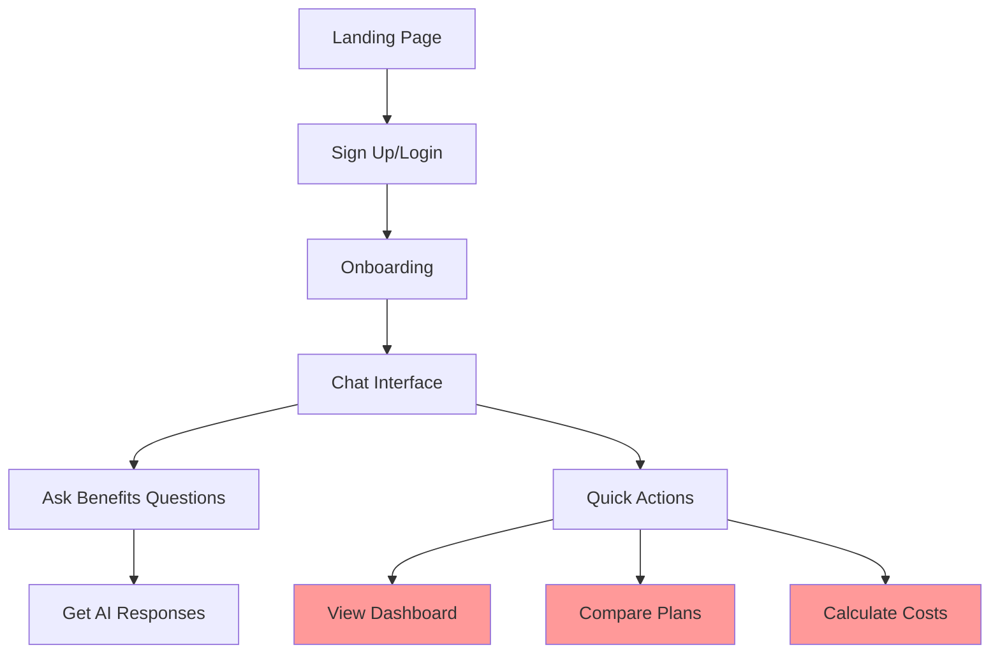
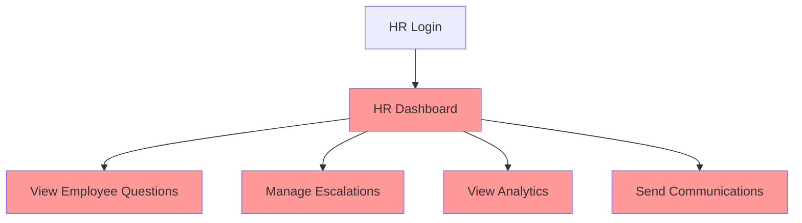
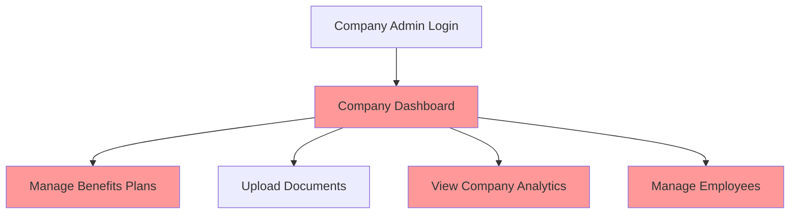
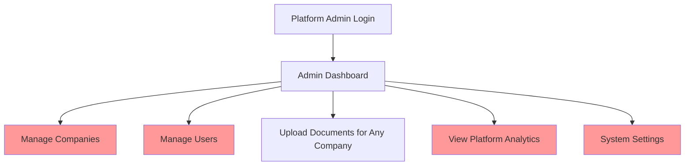

# Comprehensive Benefits Chatbot Project Audit
**Date**: August 5, 2025
**Status**: Production Readiness Assessment

## Executive Summary

This audit reveals a benefits AI chatbot application built on Next.js 15 with Stack Auth, multi-tenant architecture, and document RAG capabilities. While the foundation is solid, several critical issues need resolution before production deployment.

### Critical Findings
1. **Configuration Conflict**: Duplicate next.config files with conflicting settings
2. **Incomplete RAG Implementation**: Document upload exists but AI can't search documents
3. **Missing Email System**: No email notifications implemented
4. **Limited Analytics**: Dashboard pages exist but no data collection/visualization
5. **Incomplete User Flows**: Several admin features have UI but no backend

## Project Structure Issues

### 1. Configuration Conflicts ⚠️ CRITICAL
```
next.config.js  - ppr: false
next.config.ts  - ppr: true (CONFLICT!)
```
**Fix**: Remove next.config.js, keep TypeScript version

### 2. Database Schema Split
```
lib/db/schema.ts       - Multi-tenant tables
lib/db/schema-chat.ts  - Chat tables (duplicate User table!)
```
**Issue**: Confusing separation, duplicate user definitions
**Fix**: Consolidate into single schema or clear domain separation

### 3. Empty/Incomplete Directories
- `/lib/auth/` - Empty directory
- `/app/api/example-auth/` - Was empty (now removed)
- Several placeholder admin pages with no functionality

### 4. Documentation Overload
- 31+ markdown files
- Multiple overlapping specifications
- Outdated information in archives
**Fix**: Consolidate to single source of truth

## Complete User Flows

### 1. Employee User Flow ✅ 70% Complete

**Missing**: Dashboard, plan comparison, cost calculator implementations

### 2. HR Admin Flow ❌ 20% Complete

**Missing**: Entire HR admin functionality

### 3. Company Admin Flow ❌ 30% Complete

**Working**: Document upload
**Missing**: Everything else

### 4. Platform Admin Flow ✅ 40% Complete

**Working**: Document upload, basic navigation
**Missing**: CRUD operations, analytics, settings

## Document Upload & RAG Status

### Current Implementation ✅ Upload Works
```typescript
// Working:
- File upload to Vercel Blob ✅
- PDF text extraction ✅
- Text chunking ✅
- Embedding generation ✅
- Vector storage in Pinecone ✅
- Multi-tenant isolation ✅
```

### Missing RAG Integration ❌
```typescript
// Not Implemented:
- searchKnowledge AI tool ❌
- Vector search in chat API ❌
- Context injection to prompts ❌
- Citation display in UI ❌
- Relevance scoring ❌
```

**Required Implementation**:
1. Create `lib/ai/tools/search-knowledge.ts`
2. Integrate vector search in `/api/chat/route.ts`
3. Add citation support to message components
4. Test retrieval accuracy

## Analytics Requirements

### 1. Employee Analytics (Individual)
- Benefits usage summary
- Cost projections
- Enrollment history
- Document access logs

### 2. HR Admin Analytics
- **Question Analytics**
  - Most asked questions
  - Trending topics
  - Unanswered questions
  - Response satisfaction
- **Employee Engagement**
  - Chat usage by department
  - Peak usage times
  - Feature adoption rates
- **Escalation Metrics**
  - Volume and resolution time
  - Common escalation reasons

### 3. Company Admin Analytics
- **Enrollment Analytics**
  - Plan selection distribution
  - Cost analysis by plan
  - YoY enrollment changes
- **Usage Metrics**
  - Active users
  - Document views
  - Chat interactions
- **ROI Metrics**
  - Support ticket reduction
  - Employee satisfaction

### 4. Platform Admin Analytics
- **System Metrics**
  - Total companies/users
  - Storage usage
  - API usage
  - Error rates
- **Business Metrics**
  - Revenue by tier
  - Feature usage by company
  - Growth metrics

## Email System Requirements

### Email Types Needed
1. **Transactional Emails**
   - Welcome/onboarding
   - Password reset
   - Enrollment confirmations
   
2. **Notification Emails**
   - Open enrollment reminders
   - Deadline alerts
   - Benefits changes
   
3. **HR Communications**
   - Company-wide announcements
   - Department-specific updates
   - Individual messages

### Implementation Approach
```typescript
// Recommended: Resend.com integration
- Template management
- Bulk sending capabilities
- Analytics tracking
- Multi-tenant isolation
```

## Missing Critical Features

### 1. Core Functionality
- [ ] Employee benefits dashboard
- [ ] Plan comparison tool
- [ ] Cost calculator with real data
- [ ] Enrollment workflow
- [ ] Claims submission interface

### 2. Admin Features
- [ ] Company management CRUD
- [ ] User management interface
- [ ] Benefits plan configuration
- [ ] Email campaign management
- [ ] Analytics dashboards

### 3. System Features
- [ ] Email notification system
- [ ] RAG integration for AI
- [ ] Real-time analytics
- [ ] Audit logging
- [ ] Data export capabilities

### 4. Security & Compliance
- [ ] Row-level security policies
- [ ] API rate limiting
- [ ] Session management improvements
- [ ] HIPAA compliance features
- [ ] Data encryption at rest

## Technical Debt Inventory

### High Priority
1. **Database RLS Policies** - No row-level security
2. **Console Statements** - 39 files with console.log
3. **Type Safety** - Multiple `any` types with TODOs
4. **Error Handling** - Inconsistent error boundaries

### Medium Priority
1. **Test Coverage** - Only 15% coverage
2. **Performance** - No caching strategy
3. **Monitoring** - No error tracking
4. **Documentation** - Scattered and outdated

### Low Priority
1. **Code Organization** - Mixed concerns in components
2. **Dead Code** - Unused template components
3. **Import Patterns** - Inconsistent paths

## Development Risk Assessment

### 🔴 Risk 1: Multi-Tenant Data Isolation (CRITICAL)
**Issue**: No database-level RLS, only application-level filtering
**Impact**: Data leakage between companies
**Mitigation**:
- Implement RLS policies immediately
- Add comprehensive testing
- Regular security audits

### 🔴 Risk 2: RAG Accuracy & Performance (HIGH)
**Issue**: Unproven vector search quality
**Impact**: Incorrect benefits advice, poor user experience
**Mitigation**:
- Extensive testing with real documents
- Implement relevance scoring
- Add human-in-the-loop validation
- Monitor accuracy metrics

### 🔴 Risk 3: Scale & Performance (HIGH)
**Issue**: No caching, unoptimized queries, no CDN
**Impact**: System failure under load
**Mitigation**:
- Implement Redis caching
- Database query optimization
- CDN for static assets
- Load testing before launch

## Recommended Subagents for Development

### 1. Security Audit Agent
- Scan for vulnerabilities
- Implement RLS policies
- Add API validation
- Set up rate limiting

### 2. Testing Agent
- Create comprehensive test suite
- Achieve 80% coverage
- E2E testing setup
- Performance testing

### 3. Analytics Implementation Agent
- Set up data collection
- Create dashboard components
- Implement visualizations
- Add export capabilities

### 4. Email System Agent
- Integrate email service
- Create templates
- Set up queuing
- Add tracking

## Completion Plan

### Phase 1: Critical Security (Week 1)
1. Fix configuration conflicts
2. Implement RLS policies
3. Add API validation
4. Remove console statements

### Phase 2: Core Features (Weeks 2-3)
1. Complete RAG integration
2. Build employee dashboard
3. Implement cost calculator
4. Create plan comparison

### Phase 3: Admin Systems (Weeks 4-5)
1. Company management CRUD
2. User management interface
3. Analytics dashboards
4. Email system integration

### Phase 4: Polish & Launch (Week 6)
1. Comprehensive testing
2. Performance optimization
3. Documentation update
4. Deployment preparation

## Potential Pitfalls

1. **Underestimating RAG Complexity**
   - Solution: Allocate extra time, have fallback options

2. **Multi-Tenant Bugs**
   - Solution: Extensive testing, clear isolation patterns

3. **Performance at Scale**
   - Solution: Load test early, implement caching

4. **Compliance Requirements**
   - Solution: Research requirements early, build in compliance

5. **User Adoption**
   - Solution: Focus on UX, provide training materials

## Conclusion

The project has a solid foundation but requires significant work before production. The highest risks are security (multi-tenant isolation), RAG accuracy, and performance at scale. With focused development following this plan, the system can be production-ready in 6 weeks.

**Recommended Next Steps**:
1. Fix configuration conflicts immediately
2. Implement RLS policies this week
3. Complete RAG integration
4. Build missing admin features
5. Comprehensive testing before launch