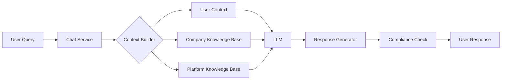
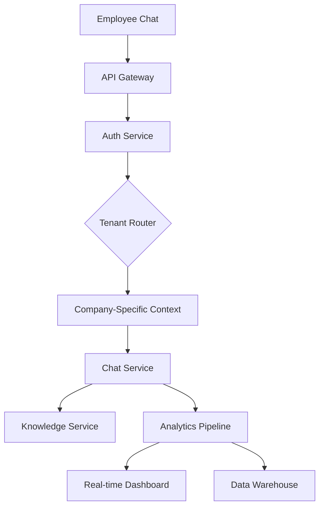
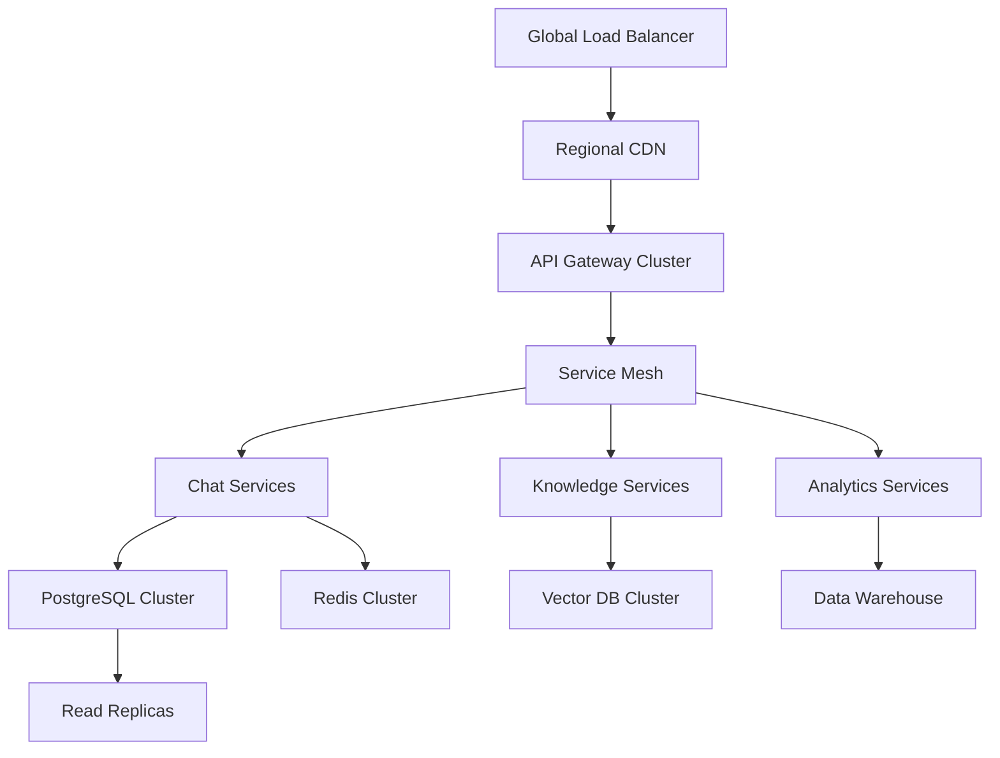

# Benefits AI Platform - White-Label SaaS Architecture

## Executive Summary

This document outlines the transformation of the current single-tenant benefits chatbot into a comprehensive white-label SaaS platform. The platform will enable multiple client companies to provide AI-powered benefits assistance to their employees while maintaining complete brand customization and data isolation.

**Platform Vision**: A fully white-labeled, AI-powered benefits assistance platform that scales to serve thousands of companies and millions of employees while maintaining security, performance, and customization.

---

## Table of Contents

1. [Platform Overview](#platform-overview)
2. [User Roles & Permissions](#user-roles--permissions)
3. [Technical Architecture](#technical-architecture)
4. [Data Architecture](#data-architecture)
5. [Feature Roadmap](#feature-roadmap)
6. [Implementation Phases](#implementation-phases)
7. [Security & Compliance](#security--compliance)
8. [Scalability Strategy](#scalability-strategy)
9. [Success Metrics](#success-metrics)

---

## Platform Overview

### Core Value Propositions

1. **For Platform Provider (You)**
   - Scalable SaaS revenue model
   - Centralized management of multiple clients
   - Comprehensive analytics across all deployments
   - Efficient knowledge base management

2. **For Client Companies**
   - Fully branded benefits assistant
   - Reduced HR workload
   - Employee satisfaction insights
   - Compliance-ready documentation

3. **For End Users (Employees)**
   - 24/7 benefits guidance
   - Personalized recommendations
   - Easy plan comparisons
   - Document analysis

### Platform Architecture Layers

```
┌─────────────────────────────────────────────────┐
│           Platform Management Layer              │
│  (Super Admin Dashboard, Client Management)      │
├─────────────────────────────────────────────────┤
│           Multi-Tenant Application Layer         │
│  (Isolated Client Instances, Branding)           │
├─────────────────────────────────────────────────┤
│           AI & Knowledge Layer                   │
│  (LLM, Vector DB, Client Knowledge Bases)        │
├─────────────────────────────────────────────────┤
│           Data & Analytics Layer                 │
│  (PostgreSQL, Redis, Analytics Pipeline)         │
├─────────────────────────────────────────────────┤
│           Infrastructure Layer                   │
│  (Vercel, AWS/GCP Services, CDN)               │
└─────────────────────────────────────────────────┘
```

---

## User Roles & Permissions

### 1. Platform Super Admin (Tier 0)

**Description**: Platform operators with complete system access

**Permissions Matrix**:
```yaml
Platform Management:
  - Create/Delete Client Accounts: ✓
  - Manage Billing & Subscriptions: ✓
  - Access All Client Data: ✓ (with audit)
  - Configure Platform Features: ✓
  - Deploy System Updates: ✓

Analytics Access:
  - Platform-wide Metrics: ✓
  - Client Comparison: ✓
  - Revenue Analytics: ✓
  - System Performance: ✓

AI Management:
  - Model Selection: ✓
  - Token Usage Monitoring: ✓
  - Knowledge Base Templates: ✓
  - Response Quality Tuning: ✓
```

### 2. Client Account Owner (Tier 1)

**Description**: Primary account holder at client company

**Permissions Matrix**:
```yaml
Account Management:
  - Manage Billing: ✓
  - Add/Remove Admins: ✓
  - Configure Branding: ✓
  - Set Usage Limits: ✓

Data Access:
  - Company-wide Analytics: ✓
  - Export All Data: ✓
  - Audit Logs: ✓
```

### 3. Client Company Admin (Tier 2)

**Description**: Benefits administrator at client company

**Permissions Matrix**:
```yaml
Benefits Management:
  - CRUD Benefit Plans: ✓
  - Manage Enrollments: ✓
  - Configure Policies: ✓

Knowledge Base:
  - Upload Documents: ✓
  - Edit FAQs: ✓
  - Approve AI Responses: ✓

Analytics:
  - Department-level View: ✓
  - Usage Reports: ✓
  - Satisfaction Metrics: ✓
```

### 4. HR Admin (Tier 3)

**Description**: HR team members supporting employees

**Permissions Matrix**:
```yaml
Support Functions:
  - View Chat Trends: ✓ (anonymized)
  - Co-browse Sessions: ✓ (with consent)
  - Update FAQs: ✓ (with approval)
  - Generate Reports: ✓

Employee Support:
  - View Enrollment Status: ✓
  - Reset User Sessions: ✓
  - Escalation Management: ✓
```

### 5. Employee (Tier 4)

**Description**: End users seeking benefits information

**Permissions Matrix**:
```yaml
Personal Access:
  - Chat with AI: ✓
  - View Own Benefits: ✓
  - Upload Documents: ✓
  - Export Chat History: ✓

Restrictions:
  - No Admin Functions: ✗
  - No Other Employee Data: ✗
  - Limited to Own Company: ✓
```

---

## Technical Architecture

### System Components

#### 1. Frontend Architecture

```typescript
// Proposed Frontend Structure
apps/
├── platform-admin/          # Super admin dashboard (Next.js)
├── client-admin/           # Client admin portal (Next.js)
├── employee-chat/          # Main chat interface (Current app)
└── mobile/                 # React Native app

packages/
├── ui-components/          # Shared UI library
├── auth/                   # Unified auth logic
├── api-client/            # TypeScript API client
└── analytics/             # Analytics utilities
```

#### 2. Backend Services

```typescript
// Microservices Architecture
services/
├── auth-service/           # Authentication & authorization
├── tenant-service/         # Multi-tenant management
├── chat-service/          # AI chat orchestration
├── knowledge-service/     # Knowledge base & vector search
├── analytics-service/     # Data pipeline & analytics
├── billing-service/       # Subscription management
└── notification-service/  # Email/SMS/Push notifications
```

#### 3. AI & Knowledge Architecture



#### 4. Data Flow Architecture



---

## Data Architecture

### Multi-Tenant Database Schema

```sql
-- Platform Level Tables
CREATE TABLE platform_accounts (
    id UUID PRIMARY KEY,
    name VARCHAR(255) NOT NULL,
    created_at TIMESTAMP DEFAULT NOW(),
    settings JSONB
);

CREATE TABLE platform_users (
    id UUID PRIMARY KEY,
    email VARCHAR(255) UNIQUE NOT NULL,
    platform_account_id UUID REFERENCES platform_accounts(id),
    role VARCHAR(50) NOT NULL
);

-- Client Level Tables
CREATE TABLE client_companies (
    id UUID PRIMARY KEY,
    platform_account_id UUID REFERENCES platform_accounts(id),
    name VARCHAR(255) NOT NULL,
    subdomain VARCHAR(100) UNIQUE NOT NULL,
    branding JSONB,
    settings JSONB,
    subscription_tier VARCHAR(50),
    created_at TIMESTAMP DEFAULT NOW()
);

CREATE TABLE client_branding (
    id UUID PRIMARY KEY,
    company_id UUID REFERENCES client_companies(id),
    logo_url VARCHAR(500),
    primary_color VARCHAR(7),
    secondary_color VARCHAR(7),
    font_family VARCHAR(100),
    custom_css TEXT,
    email_templates JSONB
);

-- Knowledge Base Tables
CREATE TABLE knowledge_bases (
    id UUID PRIMARY KEY,
    company_id UUID REFERENCES client_companies(id),
    name VARCHAR(255),
    is_active BOOLEAN DEFAULT true
);

CREATE TABLE knowledge_documents (
    id UUID PRIMARY KEY,
    knowledge_base_id UUID REFERENCES knowledge_bases(id),
    title VARCHAR(500),
    content TEXT,
    embedding_id VARCHAR(100), -- Reference to vector DB
    metadata JSONB,
    created_at TIMESTAMP DEFAULT NOW()
);

-- Analytics Tables
CREATE TABLE chat_analytics (
    id UUID PRIMARY KEY,
    company_id UUID REFERENCES client_companies(id),
    user_id UUID,
    session_id UUID,
    query TEXT,
    response TEXT,
    confidence_score DECIMAL(3,2),
    tokens_used INTEGER,
    response_time_ms INTEGER,
    satisfaction_rating INTEGER,
    created_at TIMESTAMP DEFAULT NOW()
);

-- Add indexes for performance
CREATE INDEX idx_chat_analytics_company_date ON chat_analytics(company_id, created_at);
CREATE INDEX idx_knowledge_documents_kb ON knowledge_documents(knowledge_base_id);
CREATE INDEX idx_client_companies_subdomain ON client_companies(subdomain);
```

### Tenant Isolation Strategy

```typescript
// Middleware for tenant isolation
export async function tenantMiddleware(request: Request) {
  const { hostname } = new URL(request.url);
  const subdomain = extractSubdomain(hostname);
  
  // Determine tenant from subdomain or custom domain
  const tenant = await getTenantByDomain(subdomain);
  
  if (!tenant) {
    return new Response('Tenant not found', { status: 404 });
  }
  
  // Inject tenant context into request
  request.headers.set('X-Tenant-Id', tenant.id);
  request.headers.set('X-Tenant-Tier', tenant.subscription_tier);
  
  // Apply tenant-specific rate limits
  const rateLimitResult = await checkTenantRateLimit(tenant.id);
  if (!rateLimitResult.allowed) {
    return new Response('Rate limit exceeded', { status: 429 });
  }
  
  return NextResponse.next();
}
```

---

## Feature Roadmap

### Core Features Matrix

| Feature | MVP | Phase 1 | Phase 2 | Phase 3 |
|---------|-----|---------|---------|---------|
| Basic Chat Interface | ✓ | ✓ | ✓ | ✓ |
| Multi-tenant Support | ✓ | ✓ | ✓ | ✓ |
| Custom Branding | ✓ | ✓ | ✓ | ✓ |
| Knowledge Base Upload | ✓ | ✓ | ✓ | ✓ |
| Basic Analytics | ✓ | ✓ | ✓ | ✓ |
| Platform Admin Dashboard | | ✓ | ✓ | ✓ |
| Advanced Analytics | | ✓ | ✓ | ✓ |
| API Access | | | ✓ | ✓ |
| Mobile Apps | | | ✓ | ✓ |
| HRIS Integrations | | | | ✓ |
| ML-Powered Insights | | | | ✓ |
| Voice Interface | | | | ✓ |

### Feature Descriptions

#### MVP Features (Month 1-2)

1. **Multi-tenant Chat System**
   - Isolated data per company
   - Basic role-based access
   - Secure authentication

2. **Custom Branding**
   - Logo upload
   - Color customization
   - Custom subdomain

3. **Knowledge Base Management**
   - Document upload
   - Basic search
   - FAQ management

4. **Basic Analytics**
   - Chat volume metrics
   - Common questions
   - Response times

#### Phase 1 Features (Month 3-4)

1. **Platform Admin Dashboard**
   - Client management
   - Usage monitoring
   - Billing integration

2. **Advanced Analytics**
   - Sentiment analysis
   - Topic clustering
   - ROI calculations

3. **Enhanced Knowledge Base**
   - Vector search
   - Auto-categorization
   - Version control

#### Phase 2 Features (Month 5-6)

1. **API Access**
   - RESTful API
   - Webhooks
   - Rate limiting

2. **Mobile Applications**
   - iOS app
   - Android app
   - Push notifications

3. **Advanced Branding**
   - Custom domains
   - Email templates
   - Widget customization

#### Phase 3 Features (Month 7-12)

1. **Enterprise Integrations**
   - HRIS systems
   - Benefits providers
   - SSO providers

2. **ML-Powered Features**
   - Predictive analytics
   - Anomaly detection
   - Personalization engine

3. **Voice & Accessibility**
   - Voice chat interface
   - Multi-language support
   - Accessibility compliance

---

## Implementation Phases

### Phase 0: Foundation & Planning (Week 1-2)

**Objective**: Establish technical foundation and project structure

**Tasks**:
```yaml
Week 1:
  - [ ] Set up monorepo structure
  - [ ] Configure CI/CD pipeline
  - [ ] Design complete database schema
  - [ ] Set up development environments
  - [ ] Create project documentation

Week 2:
  - [ ] Implement tenant isolation middleware
  - [ ] Set up authentication system
  - [ ] Create base UI component library
  - [ ] Configure monitoring and logging
  - [ ] Set up error tracking
```

**Deliverables**:
- Working monorepo with CI/CD
- Tenant isolation POC
- Technical documentation

### Phase 1: MVP Development (Week 3-8)

**Objective**: Launch minimum viable platform

**Week 3-4: Multi-Tenant Core**
```yaml
Backend:
  - [ ] Implement tenant management service
  - [ ] Create company/user provisioning
  - [ ] Build role-based access control
  - [ ] Set up tenant data isolation

Frontend:
  - [ ] Create company onboarding flow
  - [ ] Build user invitation system
  - [ ] Implement role switching UI
  - [ ] Add tenant context provider
```

**Week 5-6: Branding & Knowledge Base**
```yaml
Branding:
  - [ ] Logo upload and storage
  - [ ] Color scheme configuration
  - [ ] Subdomain routing
  - [ ] Dynamic theme application

Knowledge Base:
  - [ ] Document upload interface
  - [ ] Text extraction pipeline
  - [ ] Basic search functionality
  - [ ] FAQ management system
```

**Week 7-8: Analytics & Polish**
```yaml
Analytics:
  - [ ] Chat metrics collection
  - [ ] Basic dashboard creation
  - [ ] Export functionality
  - [ ] Real-time updates

Polish:
  - [ ] Performance optimization
  - [ ] Security audit
  - [ ] User acceptance testing
  - [ ] Documentation updates
```

**MVP Deliverables**:
- Multi-tenant chat platform
- 3 pilot clients onboarded
- Basic analytics dashboard
- User documentation

### Phase 2: Platform Admin & Scale (Week 9-16)

**Objective**: Build comprehensive platform management

**Week 9-10: Platform Admin Dashboard**
```yaml
Features:
  - [ ] Client management interface
  - [ ] Usage monitoring dashboard
  - [ ] Billing integration
  - [ ] Support ticket system
  - [ ] Platform health monitoring
```

**Week 11-12: Advanced Analytics**
```yaml
Features:
  - [ ] Sentiment analysis pipeline
  - [ ] Topic clustering
  - [ ] Comparative analytics
  - [ ] Custom report builder
  - [ ] Automated insights
```

**Week 13-14: Knowledge Enhancement**
```yaml
Features:
  - [ ] Vector database integration
  - [ ] Semantic search
  - [ ] Auto-tagging system
  - [ ] Knowledge base templates
  - [ ] Multi-language support
```

**Week 15-16: Performance & Security**
```yaml
Tasks:
  - [ ] Load testing
  - [ ] Security penetration testing
  - [ ] Performance optimization
  - [ ] Disaster recovery setup
  - [ ] Compliance documentation
```

### Phase 3: Mobile & API (Week 17-24)

**Objective**: Expand platform accessibility

**Week 17-20: API Development**
```yaml
Features:
  - [ ] RESTful API design
  - [ ] Authentication system
  - [ ] Rate limiting
  - [ ] Webhook system
  - [ ] API documentation
  - [ ] Client SDKs
```

**Week 21-24: Mobile Applications**
```yaml
Features:
  - [ ] React Native setup
  - [ ] iOS application
  - [ ] Android application
  - [ ] Push notifications
  - [ ] Offline support
  - [ ] App store deployment
```

### Phase 4: Enterprise Features (Month 7-12)

**Objective**: Enterprise-ready platform

**Key Features**:
- HRIS integrations (Workday, SAP, ADP)
- Advanced SSO (SAML, OAuth)
- ML-powered insights
- Voice interface
- Advanced compliance tools
- White-label mobile apps

---

## Security & Compliance

### Security Architecture

```yaml
Authentication:
  - Multi-factor authentication
  - SSO integration
  - Session management
  - Password policies

Authorization:
  - Role-based access control
  - Attribute-based access control
  - API key management
  - Tenant isolation

Data Security:
  - Encryption at rest (AES-256)
  - Encryption in transit (TLS 1.3)
  - Key management (AWS KMS)
  - Data loss prevention

Compliance:
  - HIPAA compliance ready
  - SOC 2 Type II preparation
  - GDPR compliance
  - CCPA compliance
  - Audit logging
```

### Security Implementation Checklist

```typescript
// Security middleware stack
export const securityMiddleware = [
  rateLimitMiddleware({
    windowMs: 15 * 60 * 1000,
    max: 100,
    keyGenerator: (req) => `${req.tenantId}:${req.ip}`
  }),
  
  authenticationMiddleware({
    providers: ['stack', 'saml', 'oauth'],
    mfaRequired: (user) => user.role.includes('admin')
  }),
  
  authorizationMiddleware({
    rbac: true,
    abac: true,
    tenantIsolation: true
  }),
  
  dataValidationMiddleware({
    sanitization: true,
    schemaValidation: true
  }),
  
  auditLoggingMiddleware({
    logLevel: 'info',
    sensitiveDataMasking: true
  })
];
```

---

## Scalability Strategy

### Performance Targets

```yaml
Response Times:
  - Chat API: < 200ms (p95)
  - Dashboard Load: < 1s
  - Search Results: < 500ms
  - Analytics Query: < 2s

Scale Targets:
  - Concurrent Users: 100,000
  - Messages/Second: 10,000
  - Storage/Client: Unlimited
  - Uptime SLA: 99.9%
```

### Scaling Architecture



### Caching Strategy

```typescript
// Multi-level caching
const cacheStrategy = {
  edge: {
    // CDN caching for static assets
    static: '1 year',
    api: 'no-cache'
  },
  
  application: {
    // Redis caching
    userSessions: '24 hours',
    companySettings: '1 hour',
    knowledgeBase: '15 minutes',
    analytics: '5 minutes'
  },
  
  database: {
    // Query result caching
    benefitPlans: '1 hour',
    enrollments: '15 minutes',
    chatHistory: 'no-cache'
  }
};
```

---

## Success Metrics

### Platform KPIs

```yaml
Business Metrics:
  - Monthly Recurring Revenue (MRR)
  - Client Acquisition Cost (CAC)
  - Client Lifetime Value (LTV)
  - Churn Rate
  - Net Promoter Score (NPS)

Operational Metrics:
  - Platform Uptime
  - Average Response Time
  - Error Rate
  - Support Ticket Volume
  - Time to Resolution

Usage Metrics:
  - Daily Active Users (DAU)
  - Messages per User
  - Knowledge Base Queries
  - API Calls per Client
  - Mobile vs Web Usage

Quality Metrics:
  - AI Response Accuracy
  - User Satisfaction Score
  - Escalation Rate
  - Resolution Rate
  - Repeat Question Rate
```

### Client Success Metrics

```yaml
HR Efficiency:
  - Reduction in HR tickets
  - Time saved per query
  - Employee self-service rate

Employee Satisfaction:
  - Benefits understanding score
  - Enrollment completion rate
  - Question resolution rate

Cost Savings:
  - Reduced benefits administration cost
  - Decreased enrollment errors
  - Improved benefits utilization
```

---

## Risk Mitigation

### Technical Risks

| Risk | Impact | Mitigation Strategy |
|------|--------|-------------------|
| Data breach | Critical | Multi-layer security, encryption, regular audits |
| Platform outage | High | Multi-region deployment, auto-failover |
| AI hallucination | Medium | Confidence scoring, human review option |
| Scaling issues | High | Auto-scaling, performance monitoring |
| Integration failures | Medium | Circuit breakers, retry mechanisms |

### Business Risks

| Risk | Impact | Mitigation Strategy |
|------|--------|-------------------|
| Client churn | High | Success team, regular check-ins, feature updates |
| Compliance issues | Critical | Legal review, compliance team, regular audits |
| Competition | Medium | Continuous innovation, strong partnerships |
| Cost overruns | High | Usage monitoring, tiered pricing, cost alerts |

---

## Development Team Structure

### Recommended Team Composition

```yaml
Engineering (10-12 people):
  - Platform Architect (1)
  - Backend Engineers (4)
  - Frontend Engineers (3)
  - DevOps Engineers (2)
  - QA Engineers (2)

Product & Design (3-4 people):
  - Product Manager (1)
  - UX Designer (1)
  - UI Designer (1)
  - Technical Writer (1)

AI & Data (3-4 people):
  - ML Engineer (1)
  - Data Engineer (1)
  - Data Analyst (1)
  - AI Prompt Engineer (1)

Operations (3-4 people):
  - Customer Success Manager (2)
  - Support Engineer (1)
  - Security Engineer (1)
```

---

## Budget Estimation

### Infrastructure Costs (Monthly)

```yaml
Hosting & Compute:
  - Vercel Enterprise: $3,000
  - Database (PostgreSQL): $2,000
  - Vector Database: $1,500
  - Redis Cluster: $500
  - CDN: $1,000

AI & Services:
  - LLM API Costs: $5,000-$20,000
  - Monitoring (Datadog): $2,000
  - Email Service: $500
  - SMS Service: $300

Security & Compliance:
  - WAF: $1,000
  - Security Scanning: $500
  - Backup Services: $1,000
  
Total: ~$18,000-$33,000/month
```

### Development Timeline

```yaml
MVP: 2 months
Phase 1: +2 months  
Phase 2: +2 months
Phase 3: +6 months

Total to Full Platform: 12 months
```

---

## Next Steps

### Immediate Actions (Week 1)

1. **Technical Setup**
   - [ ] Create monorepo structure
   - [ ] Set up CI/CD pipeline
   - [ ] Configure development environments
   - [ ] Initialize documentation

2. **Team Formation**
   - [ ] Hire key technical roles
   - [ ] Establish development process
   - [ ] Set up communication channels
   - [ ] Define sprint structure

3. **Planning Refinement**
   - [ ] Validate assumptions with stakeholders
   - [ ] Prioritize MVP features
   - [ ] Create detailed sprint plans
   - [ ] Set up tracking metrics

### Quick Wins (Month 1)

1. **Tenant Isolation**
   - Implement middleware
   - Test with 2 dummy tenants
   - Document patterns

2. **Basic Branding**
   - Logo upload
   - Color customization
   - Subdomain routing

3. **Platform Dashboard**
   - Basic client list
   - Usage metrics
   - Simple management

---

## Conclusion

This platform architecture provides a clear path from the current single-tenant application to a scalable, white-label SaaS platform. The phased approach allows for iterative development while maintaining production stability and delivering value to early clients.

The key success factors will be:
1. Strong tenant isolation from day one
2. Flexible branding system
3. Robust knowledge management
4. Comprehensive analytics
5. Exceptional security

With proper execution, this platform can scale to serve thousands of companies and millions of employees while maintaining high performance and security standards.

---

*Last Updated: 2025-07-28*
*Version: 1.0*
*Status: Draft - Pending Stakeholder Review*