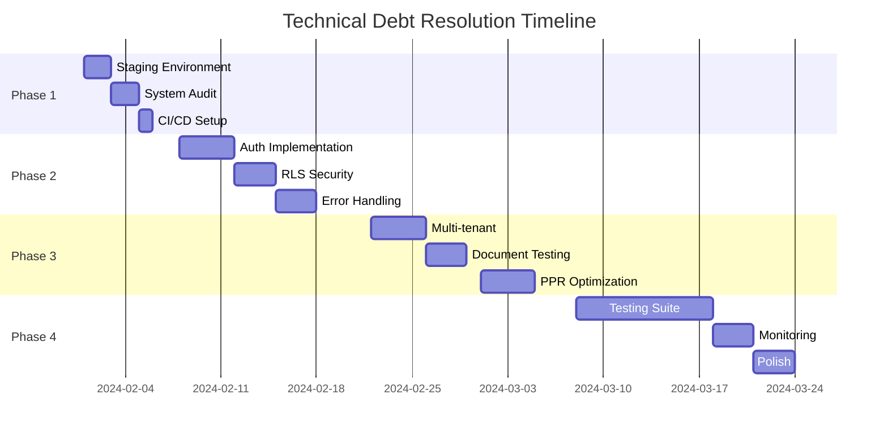

# Technical Debt Resolution Plan - Benefits AI Platform

## Executive Summary
This plan addresses 18 technical debt items (125-175 hours) accumulated during development. The approach prioritizes critical security and stability issues while establishing sustainable development practices.

**Timeline**: 6-8 weeks of focused effort
**Goal**: Restore platform stability, security, and development velocity

---

## Phase 1: Emergency Stabilization (Week 1)
**Focus**: Stop the bleeding and establish safe development practices

### Day 1-2: Staging Environment & Testing Infrastructure
**DEBT-018: No Staging Environment** (4-6 hours)

```bash
# 1. Create staging branch
git checkout -b staging
git push -u origin staging

# 2. Set up Vercel preview deployments
# - Configure preview for 'staging' branch
# - Set up separate env vars for staging
# - Create staging database

# 3. Establish deployment pipeline
# feature/* → staging → main
```

**Deliverables**:
- [ ] Staging environment live
- [ ] Preview deployments configured
- [ ] Deployment documentation
- [ ] Environment variable matrix

### Day 3-4: System Audit & Documentation
**DEBT-017: Broken Project Structure** (8-12 hours)

```markdown
## Feature Audit Checklist
- [ ] Authentication flow (login, logout, session)
- [ ] Document upload functionality
- [ ] AI chat features
- [ ] Admin interfaces
- [ ] Multi-tenant isolation
- [ ] API endpoints
```

**Action Items**:
1. Test every feature systematically
2. Document what works vs broken
3. Create visual flow diagrams
4. Remove dead code from failed attempts

### Day 5: Pre-commit Hooks & CI/CD
**DEBT-005: Build and Deploy Process** (3-4 hours)

```json
// package.json
{
  "scripts": {
    "pre-commit": "lint-staged",
    "prepare": "husky install"
  },
  "lint-staged": {
    "*.{ts,tsx}": ["eslint --fix", "prettier --write"],
    "*.{js,jsx}": ["eslint --fix", "prettier --write"]
  }
}
```

```yaml
# .github/workflows/ci.yml
name: CI
on: [push, pull_request]
jobs:
  test:
    runs-on: ubuntu-latest
    steps:
      - uses: actions/checkout@v3
      - uses: actions/setup-node@v3
      - run: pnpm install
      - run: pnpm tsc --noEmit
      - run: pnpm lint
      - run: pnpm build
```

---

## Phase 2: Critical Security & Stability (Week 2-3)
**Focus**: Fix security vulnerabilities and core functionality

### Week 2: Authentication & Security

#### DEBT-001 & DEBT-014: Complete Stack Auth Implementation (8-12 hours)
```typescript
// app/handler/[...stack]/route.ts
import { StackHandler } from '@stackframe/stack/next';
import { stackServerApp } from '@/stack';

// Research and implement proper handler pattern
// Test all auth flows:
// - Sign in/up
// - OAuth providers
// - Password reset
// - Email verification
// - Session management
```

#### DEBT-002: Row-Level Security Implementation (6-8 hours)
```sql
-- migrations/add-rls-policies.sql

-- Enable RLS on all tables
ALTER TABLE companies ENABLE ROW LEVEL SECURITY;
ALTER TABLE users ENABLE ROW LEVEL SECURITY;
ALTER TABLE benefit_plans ENABLE ROW LEVEL SECURITY;
ALTER TABLE benefit_enrollments ENABLE ROW LEVEL SECURITY;

-- Company isolation policy
CREATE POLICY "tenant_isolation" ON companies
  FOR ALL USING (id = current_setting('app.company_id')::uuid);

-- User access policy  
CREATE POLICY "user_access" ON users
  FOR ALL USING (company_id = current_setting('app.company_id')::uuid);
```

#### DEBT-007: Restore Middleware Protection (3-4 hours)
```typescript
// middleware.ts
import { auth } from '@/app/(auth)/stack-auth';

export async function middleware(request: NextRequest) {
  const session = await auth();
  const isProtectedRoute = protectedRoutes.some(route => 
    request.nextUrl.pathname.startsWith(route)
  );
  
  if (isProtectedRoute && !session) {
    return NextResponse.redirect(new URL('/login', request.url));
  }
  
  // Set tenant context header
  if (session?.user?.companyId) {
    request.headers.set('X-Company-Id', session.user.companyId);
  }
  
  return NextResponse.next();
}
```

### Week 3: Error Handling & Stability

#### DEBT-003: Error Boundaries & Handling (4-6 hours)
```typescript
// app/error.tsx
'use client';

export default function GlobalError({
  error,
  reset,
}: {
  error: Error & { digest?: string };
  reset: () => void;
}) {
  return (
    <html>
      <body>
        <ErrorBoundary error={error} reset={reset} />
      </body>
    </html>
  );
}

// components/error-boundary.tsx
export function ErrorBoundary({ error, reset }) {
  // User-friendly error UI
  // Error logging to monitoring service
  // Retry mechanism
}
```

#### DEBT-006: Environment Variable Management (2-3 hours)
```typescript
// lib/env.ts
import { z } from 'zod';

const envSchema = z.object({
  // Stack Auth
  NEXT_PUBLIC_STACK_PROJECT_ID: z.string(),
  NEXT_PUBLIC_STACK_PUBLISHABLE_CLIENT_KEY: z.string(),
  STACK_SECRET_SERVER_KEY: z.string(),
  
  // Database
  DATABASE_URL: z.string().url(),
  
  // Required services
  OPENAI_API_KEY: z.string(),
  PINECONE_API_KEY: z.string().optional(),
});

export const env = envSchema.parse(process.env);
```

---

## Phase 3: Feature Restoration (Week 4-5)
**Focus**: Restore and test all platform features

### Week 4: Multi-tenant & Document Processing

#### DEBT-004: Complete Multi-tenant Implementation (8-10 hours)
```typescript
// lib/db/tenant-context.ts
export class TenantContext {
  static async forCompany<T>(
    companyId: string, 
    callback: () => Promise<T>
  ): Promise<T> {
    return await asyncLocalStorage.run({ companyId }, callback);
  }
  
  static getCurrentCompanyId(): string {
    const store = asyncLocalStorage.getStore();
    if (!store?.companyId) {
      throw new Error('No tenant context');
    }
    return store.companyId;
  }
}
```

#### DEBT-008: Test Document Processing Pipeline (4-6 hours)
```typescript
// __tests__/document-processing.test.ts
describe('Document Processing', () => {
  test('upload to blob storage', async () => {});
  test('chunk documents correctly', async () => {});
  test('generate embeddings', async () => {});
  test('store in vector database', async () => {});
  test('query documents', async () => {});
});
```

### Week 5: Performance & Polish

#### DEBT-015: Re-enable PPR Strategically (8-12 hours)
```typescript
// next.config.js
const nextConfig = {
  experimental: {
    ppr: true,
    pprFallbacks: {
      // Define static pages that don't use auth
      '/': 'static',
      '/about': 'static',
      '/pricing': 'static',
      // Dynamic pages that need auth
      '/dashboard/*': 'blocking',
      '/admin/*': 'blocking',
    }
  }
};
```

#### DEBT-009: Fix TypeScript Issues (4-6 hours)
```json
// tsconfig.json
{
  "compilerOptions": {
    "strict": true,
    "noImplicitAny": true,
    "strictNullChecks": true,
    "noUnusedLocals": true,
    "noUnusedParameters": true
  }
}
```

---

## Phase 4: Long-term Quality (Week 6-8)
**Focus**: Testing, monitoring, and documentation

### Week 6: Testing Infrastructure

#### DEBT-012: Comprehensive Testing Suite (20-30 hours)
```typescript
// Test structure
__tests__/
├── unit/
│   ├── auth/
│   ├── api/
│   └── components/
├── integration/
│   ├── auth-flow.test.ts
│   ├── document-processing.test.ts
│   └── multi-tenant.test.ts
└── e2e/
    ├── user-journey.spec.ts
    └── admin-flow.spec.ts
```

### Week 7-8: Monitoring & Polish

#### DEBT-010: Proper Logging Infrastructure (2-3 hours)
```typescript
// lib/logger.ts
import winston from 'winston';

export const logger = winston.createLogger({
  level: process.env.LOG_LEVEL || 'info',
  format: winston.format.json(),
  transports: [
    new winston.transports.Console(),
    // Add cloud logging service
  ],
});
```

#### DEBT-011: Loading States (3-4 hours)
#### DEBT-013: Error Messages (2-3 hours)

---

## Implementation Schedule



---

## Success Metrics

### Week 1 Completion:
- [ ] Zero production deployments without staging test
- [ ] All features audited and documented
- [ ] CI/CD preventing bad commits

### Week 2-3 Completion:
- [ ] Authentication fully functional
- [ ] RLS policies protecting all data
- [ ] Zero unhandled errors in production

### Week 4-5 Completion:
- [ ] All features restored and working
- [ ] Performance back to optimal levels
- [ ] TypeScript strict mode enabled

### Week 6-8 Completion:
- [ ] 80%+ test coverage
- [ ] <1% error rate in production
- [ ] All technical debt resolved

---

## Risk Mitigation

1. **Parallel Work**: Multiple developers can work on different phases
2. **Incremental Delivery**: Each phase provides immediate value
3. **Rollback Plan**: Staging allows safe testing of all changes
4. **Documentation**: Every fix includes updated documentation

---

## Cost-Benefit Analysis

**Investment**: 125-175 hours (3-4 developer weeks)

**Returns**:
- Eliminate security vulnerabilities
- Restore user trust
- Enable rapid feature development
- Reduce bug rate by 80%+
- Improve developer productivity 3x

**Break-even**: 2 months (via reduced bug fixes and faster feature delivery)

---

## Conclusion

This plan transforms the current technical debt crisis into a systematic improvement process. By following this structured approach, the platform will emerge more stable, secure, and maintainable than ever before.

The key is to:
1. Stop making the problem worse (staging environment)
2. Fix critical issues first (security, auth)
3. Restore functionality systematically
4. Build quality infrastructure for the future

With disciplined execution, this technical debt can be eliminated in 6-8 weeks, setting the platform up for long-term success.