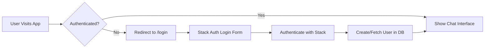
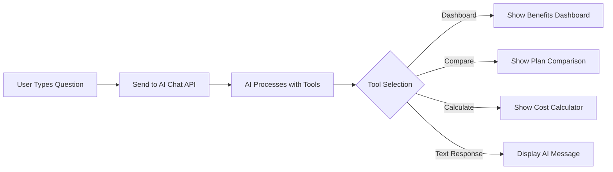
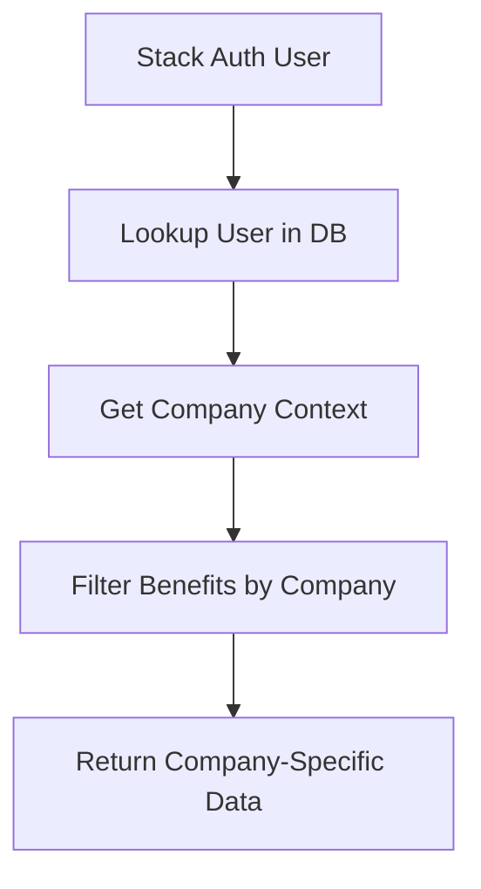

# Benefits AI Chatbot - Architecture Documentation

## Table of Contents

1. [User Flows](#user-flows)
2. [Information Architecture](#information-architecture)
3. [Project Structure](#project-structure)
4. [Tech Stack](#tech-stack)
5. [File & Folder Documentation](#file--folder-documentation)
6. [Development Challenges](#development-challenges)

---

## User Flows

### 1. Authentication Flow



### 2. Benefits Query Flow



### 3. Multi-Tenant Data Flow



---

## Information Architecture

### Data Hierarchy

```
Stack Auth Organization
├── Company (Multi-tenant)
│   ├── Users (Employees)
│   │   ├── Roles (employee, hr_admin, company_admin)
│   │   └── Enrollments
│   ├── Benefit Plans
│   │   ├── Health Plans
│   │   ├── Dental Plans
│   │   ├── Vision Plans
│   │   └── Other Benefits
│   └── Knowledge Base
│       ├── Documents
│       └── FAQs
└── Chat System
    ├── Conversations
    ├── Messages
    └── AI Tools
```

### User Roles & Permissions

- **Guest**: Limited chat access, no benefits data
- **Employee**: View own benefits, use calculators
- **HR Admin**: View all employee benefits, manage knowledge base
- **Company Admin**: Full access, manage plans and settings

---

## Project Structure

```
benefitschatbot/
├── app/                          # Next.js App Router
│   ├── (auth)/                   # Authentication group
│   │   ├── login/                # Login page
│   │   ├── register/             # Registration page
│   │   └── stack-auth.ts         # Stack Auth integration
│   ├── (chat)/                   # Chat interface group
│   │   ├── api/                  # Chat API endpoints
│   │   ├── chat/[id]/            # Dynamic chat pages
│   │   └── page.tsx              # Main chat page
│   ├── handler/[...stack]/       # Stack Auth handlers
│   └── layout.tsx                # Root layout with providers
├── artifacts/                    # AI artifact generation (UNUSED)
├── components/                   # React components
│   ├── ui/                       # shadcn/ui components
│   └── [feature components]      # App-specific components
├── hooks/                        # Custom React hooks
├── lib/                          # Core business logic
│   ├── ai/                       # AI configuration
│   │   ├── tools/                # AI tool implementations
│   │   └── providers.ts          # AI model configuration
│   ├── db/                       # Database layer
│   │   ├── migrations/           # Database migrations
│   │   ├── repositories/         # Data access patterns
│   │   └── schema-v2.ts          # Database schema
│   └── types/                    # TypeScript types
├── public/                       # Static assets
├── scripts/                      # Utility scripts
├── tests/                        # Test files
└── types/                        # Global type definitions
```

---

## Tech Stack

### Core Framework

- **Next.js**: 15.3.0-canary.31 (App Router, React 19 RC)
- **React**: 19.0.0-rc-45804af1-20241021 (Release Candidate)
- **TypeScript**: 5.6.3

### UI & Styling

- **Tailwind CSS**: 3.4.1
- **shadcn/ui**: Component library
- **Framer Motion**: 11.3.19 (Animations)
- **Lucide React**: 0.446.0 (Icons)

### AI & LLM

- **AI SDK**: 5.0.0-beta.6 (Vercel AI SDK - Beta)
- **Google Generative AI**: Gemini 1.5 Pro
- **OpenAI**: Ready for GPT-4 (not active)

### Authentication

- **Stack Auth**: 2.8.22 (@stackframe/stack)
- **Multi-tenant**: Stack Organizations

### Database

- **PostgreSQL**: Via Neon Postgres
- **Drizzle ORM**: 0.34.0
- **Redis**: 5.0.0 (For caching - not fully implemented)

### Development Tools

- **pnpm**: 9.12.3 (Package manager)
- **Biome**: 1.9.4 (Linting/Formatting)
- **Vitest**: For testing
- **Playwright**: E2E testing

### Deployment

- **Vercel**: Hosting platform
- **Edge Runtime**: Serverless functions

---

## File & Folder Documentation

### `/app` Directory

#### `/app/(auth)/`

- **Purpose**: Authentication-related pages and logic
- **Files**:
  - `stack-auth.ts`: Stack Auth integration and helper functions
  - `login/page.tsx`: Login page using Stack Auth components
  - `register/page.tsx`: Registration page using Stack Auth components
  - ~~`auth.ts`~~ (REMOVED - was NextAuth)
  - ~~`auth.config.ts`~~ (REMOVED - was NextAuth)
  - ~~`actions.ts`~~ (REMOVED - was NextAuth)

#### `/app/(chat)/`

- **Purpose**: Main chat interface and API
- **Key Files**:
  - `api/chat/route.ts`: Main AI chat endpoint
  - `api/chat/[id]/stream/route.ts`: Streaming chat responses
  - `api/document/route.ts`: Document operations
  - `api/history/route.ts`: Chat history
  - `page.tsx`: Main chat interface
  - `layout.tsx`: Chat layout with sidebar

#### `/app/handler/[...stack]/`

- **Purpose**: Stack Auth route handlers
- **Files**:
  - `route.ts`: Handles Stack Auth callbacks

### `/components` Directory

#### Feature Components

- `benefits-dashboard.tsx`: Visual benefits overview
- `plan-comparison.tsx`: Compare benefit plans
- `cost-calculator.tsx`: Benefits cost calculator
- `chat.tsx`: Main chat interface
- `message.tsx`: Chat message display
- `app-sidebar.tsx`: Application sidebar

#### Unused/Legacy Components

- `auth-form.tsx`: Legacy auth form (NextAuth)
- `weather.tsx`: Demo component (not used)
- `document-*.tsx`: Document editing features (not fully implemented)
- `artifact-*.tsx`: AI artifact system (not used)

### `/lib` Directory

#### `/lib/ai/`

- **Purpose**: AI configuration and tools
- **Key Files**:
  - `tools/show-benefits-dashboard.ts`: Dashboard data tool
  - `tools/compare-benefits-plans.ts`: Plan comparison tool
  - `tools/calculate-benefits-cost.ts`: Cost calculation tool
  - `prompts.ts`: System prompts for AI
  - `models.ts`: AI model configuration

#### `/lib/db/`

- **Purpose**: Database layer
- **Key Files**:
  - `schema-v2.ts`: Multi-tenant database schema
  - `queries.ts`: Database queries (partially legacy)
  - `index.ts`: Database connection export
  - `repositories/`: New repository pattern (multi-tenant)
  - ~~`schema.ts`~~ (DEPRECATED - use schema-v2.ts)

#### `/lib/repositories/` (DEPRECATED)

- **Status**: Should be removed
- **Use Instead**: `/lib/db/repositories/`

### `/scripts` Directory

- `insert-sample-data.ts`: Seed database with sample data
- `fix-ai-types.ts`: TypeScript patches for AI SDK
- `run-migration.ts`: Database migration runner
- `seed-test-fixtures.ts`: Test data seeding

### `/types` Directory

- `ai-sdk-patch.d.ts`: TypeScript patches for AI SDK beta
- `ai.d.ts`: AI-related type definitions

### Root Configuration Files

- `stack.ts`: Stack Auth configuration
- `middleware.ts`: Next.js middleware for auth
- `drizzle.config.ts`: Drizzle ORM configuration
- `vercel.json`: Vercel deployment configuration
- `.env.example`: Environment variable template
- `claude.md`: AI assistant instructions
- `AuditReport.md`: Security audit findings

### Unused/Legacy Files

1. `/artifacts/` - Entire directory unused
2. `/components/weather.tsx` - Demo component
3. `/lib/ai/tools/get-weather.ts` - Demo tool
4. `/lib/ai/tools/create-document.ts` - Not implemented
5. `/lib/ai/tools/update-document.ts` - Not implemented
6. `/components/document-*.tsx` - Document features not used
7. `/lib/repositories/` - Old repository pattern

---

## Development Challenges

### 1. 🔴 Critical Issues

#### Tenant Isolation Not Implemented

```typescript
// Current queries don't filter by company
const plans = await db.select().from(benefitPlans);

// Should be:
const plans = await db.select()
  .from(benefitPlans)
  .where(eq(benefitPlans.companyId, userCompanyId));
```

#### User Onboarding Flow Missing

- No way to assign users to companies
- No company creation flow
- No initial data setup

### 2. 🟠 High Priority Issues

#### AI SDK Beta Instability

- Using beta version with manual type patches
- May break with updates
- Consider downgrading to stable v3.x

#### Incomplete Multi-tenant Implementation

- Schema exists but not used consistently
- Need tenant context middleware
- Repository pattern partially implemented

#### No Caching Strategy

- Redis configured but not used
- Expensive calculations repeated
- No query result caching

### 3. 🟡 Medium Priority Issues

#### Mixed Repository Patterns

- Old pattern in `/lib/repositories/`
- New pattern in `/lib/db/repositories/`
- Inconsistent usage across codebase

#### Incomplete Features

- Document management system scaffolded but not implemented
- Artifact system completely unused
- Knowledge base tables exist but no UI

#### No Error Tracking

- Basic console logging only
- No production error aggregation
- No performance monitoring

### 4. 🔵 Low Priority Issues

#### Test Coverage

- Minimal test implementation
- E2E tests exist but limited
- No unit tests for business logic

#### Bundle Size

- Using heavy dependencies
- No code splitting implemented
- Could optimize for performance

---

## Recommended Next Steps

### Immediate (1-2 days)

1. Implement tenant isolation middleware
2. Create user onboarding flow
3. Remove unused files and directories

### Short Term (1 week)

1. Implement company assignment during registration
2. Add tenant filtering to all queries
3. Create company admin dashboard
4. Implement basic caching

### Medium Term (2-4 weeks)

1. Downgrade to stable AI SDK version
2. Implement knowledge base UI
3. Add comprehensive error tracking
4. Create admin tools for benefit plan management

### Long Term (1-2 months)

1. Implement document management system
2. Add advanced analytics
3. Create mobile app
4. Implement full test coverage

---

## Architecture Decisions

### Why Stack Auth?

- Built for multi-tenant SaaS
- Simple integration with Next.js
- Handles organizations natively

### Why Drizzle ORM?

- Type-safe database queries
- Excellent PostgreSQL support
- Good migration tooling

### Why AI SDK Beta?

- Latest features for streaming
- Better tool support
- (Trade-off: stability issues)

### Why Vercel?

- Seamless Next.js integration
- Edge functions for AI
- Built-in analytics

---

*Last Updated: 2025-07-28*
