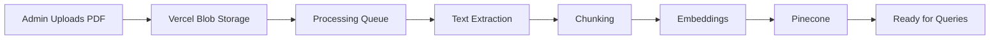
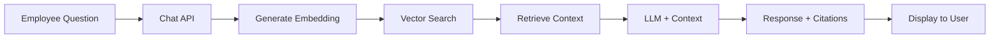

# Benefits AI Platform - Phase 2: Complete Single Company Implementation

## Executive Summary

This document outlines the **complete implementation plan** for setting up a single company on the Benefits AI Platform. Every feature listed here will be built with both frontend and backend in the same phase. The focus is on delivering a **fully functional benefits assistant** for one company, with all administrative capabilities operational.

**Current State**: Multi-tenant infrastructure is complete with role-based authentication. Platform admin and company admin dashboards exist but lack functionality.

**Goal**: Complete implementation where a platform admin can fully configure a company with benefits documents, branding, and employees, resulting in a working AI assistant that answers benefits questions using uploaded company documents.

---

## 🏗️ Current Implementation Status

### ✅ Completed Components
1. **Multi-tenant Database Schema** - Companies, users, benefits tables with tenant isolation
2. **Authentication System** - Stack Auth with role-based access (platform_admin, company_admin, hr_admin, employee)
3. **Basic Admin Dashboards** - UI shells for platform and company admins
4. **AI Chat Interface** - Working chat with GPT-4, but no document knowledge
5. **Role-based Routing** - Users directed to appropriate interfaces

### ❌ Missing Critical Components
1. **Document Upload & Processing** - No way to upload benefits PDFs
2. **Vector Database Integration** - No document embeddings or retrieval
3. **Company Configuration** - No branding, settings, or customization
4. **Employee Management** - No invite system or user provisioning
5. **Analytics & Reporting** - No usage tracking or insights
6. **Knowledge Base Management** - No FAQ or policy management

---

## 🎯 Phase 2: Complete Single Company Setup

### Overview
Enable a platform admin to completely set up ONE company with all features operational. This includes document upload, processing, branding, employee management, and a fully functional AI assistant.

### Success Criteria
- Platform admin can create and configure a complete company
- Company admins can manage their benefits and employees
- Employees can ask questions and get accurate answers from uploaded documents
- All analytics and reporting functional
- Complete branding and customization applied

---

## 📋 Detailed Implementation Tasks

### 1. Document Management System (Week 1)

#### 1.1 Document Upload Infrastructure
**Frontend Tasks:**
```typescript
// app/admin/companies/[companyId]/documents/page.tsx
- Drag-and-drop upload interface
- File type validation (PDF, DOCX, TXT)
- Upload progress indicators
- Document preview capability
- Bulk upload support
- Document categorization UI
```

**Backend Tasks:**
```typescript
// app/api/admin/documents/upload/route.ts
- Vercel Blob storage integration
- File validation and sanitization
- Metadata extraction
- Database record creation
- Background job triggering
```

**Database Schema:**
```sql
-- Already exists, but needs to be used
knowledge_base_documents (
  id, company_id, title, content, document_type,
  category, tags, file_url, file_type, processed_at
)

-- New table needed
document_processing_jobs (
  id UUID PRIMARY KEY,
  document_id UUID REFERENCES knowledge_base_documents(id),
  status VARCHAR(50), -- pending, processing, completed, failed
  error_message TEXT,
  started_at TIMESTAMP,
  completed_at TIMESTAMP
)
```

#### 1.2 Document Processing Pipeline
**Backend Implementation:**
```typescript
// lib/documents/processor.ts
- PDF text extraction using pdf-parse
- Document chunking (1000 token chunks with 200 token overlap)
- Metadata preservation per chunk
- Error handling and retry logic

// lib/documents/embeddings.ts
- OpenAI embeddings generation
- Batch processing for efficiency
- Vector normalization

// lib/documents/vector-store.ts
- Pinecone client setup
- Namespace per company
- Upsert vectors with metadata
- Index management
```

**Required Environment Variables:**
```env
PINECONE_API_KEY=
PINECONE_ENVIRONMENT=
PINECONE_INDEX_NAME=
BLOB_READ_WRITE_TOKEN=
```

#### 1.3 Document Management UI
**Frontend Components:**
```typescript
// components/admin/document-manager.tsx
- Document list with filters
- Search functionality
- Reprocess capability
- Delete with confirmation
- Processing status display
- Document analytics
```

---

### 2. AI Knowledge Integration (Week 1-2)

#### 2.1 RAG (Retrieval Augmented Generation) Implementation
**Backend Tasks:**
```typescript
// lib/ai/tools/search-knowledge.ts
export async function searchKnowledge(params: {
  query: string;
  companyId: string;
  limit?: number;
}) {
  // Query Pinecone for relevant chunks
  // Rerank results
  // Format for LLM context
  // Return with citations
}

// lib/ai/rag-prompt-builder.ts
- Context injection strategies
- Token limit management
- Citation formatting
- Fallback handling
```

#### 2.2 Enhanced Chat Interface
**Frontend Updates:**
```typescript
// components/chat-message.tsx
- Citation display
- Source document links
- Confidence indicators
- Feedback mechanisms
```

**Backend Updates:**
```typescript
// app/api/chat/route.ts
- Integrate searchKnowledge tool
- Add context to system prompt
- Track document usage
- Log citations
```

---

### 3. Company Configuration System (Week 2)

#### 3.1 Branding Management
**Frontend Tasks:**
```typescript
// app/admin/companies/[companyId]/branding/page.tsx
- Logo upload with preview
- Color picker for primary/secondary colors
- Font selection
- Custom CSS editor
- Email template editor
- Preview in context
```

**Backend Tasks:**
```typescript
// app/api/admin/companies/[companyId]/branding/route.ts
- Logo storage in Vercel Blob
- Branding validation
- Dynamic CSS generation
- Cache invalidation
```

#### 3.2 Company Settings
**Frontend Tasks:**
```typescript
// app/admin/companies/[companyId]/settings/page.tsx
- Subscription tier management
- Feature toggles
- AI behavior settings
- Usage limits configuration
- Notification preferences
- Integration settings
```

---

### 4. Employee Management System (Week 2)

#### 4.1 Bulk Employee Import
**Frontend Tasks:**
```typescript
// app/company-admin/employees/import/page.tsx
- CSV template download
- Drag-and-drop CSV upload
- Preview with validation
- Error highlighting
- Mapping interface
```

**Backend Tasks:**
```typescript
// app/api/company-admin/employees/import/route.ts
- CSV parsing with validation
- Duplicate detection
- Batch user creation
- Email invitation queue
- Progress tracking
```

#### 4.2 Employee Invitation System
**Frontend Tasks:**
```typescript
// components/admin/invite-employees.tsx
- Individual invite form
- Bulk invite interface
- Invitation tracking
- Resend capability
- Revoke access
```

**Backend Tasks:**
```typescript
// app/api/invitations/route.ts
- Generate secure invitation tokens
- Send invitation emails (Resend/SendGrid)
- Track invitation status
- Auto-expire old invitations
```

---

### 5. Analytics & Reporting (Week 3)

#### 5.1 Platform Analytics Dashboard
**Frontend Tasks:**
```typescript
// app/admin/analytics/page.tsx
- Company comparison charts
- Usage trends
- Cost analysis
- Performance metrics
- Export functionality
```

**Backend Tasks:**
```typescript
// app/api/admin/analytics/route.ts
- Aggregate metrics calculation
- Time-series data
- Caching strategy
- Export generation
```

#### 5.2 Company Analytics Dashboard
**Frontend Tasks:**
```typescript
// app/company-admin/analytics/page.tsx
- User engagement metrics
- Popular questions
- Knowledge gap analysis
- Department breakdown
- Satisfaction scores
```

**Analytics Events to Track:**
```typescript
interface AnalyticsEvent {
  event_type: 
    | 'chat_message'
    | 'document_view'
    | 'plan_comparison'
    | 'cost_calculation'
    | 'enrollment_start'
    | 'feedback_provided';
  user_id: string;
  company_id: string;
  event_data: Record<string, any>;
  session_id: string;
}
```

---

### 6. Benefits Configuration (Week 3)

#### 6.1 Enhanced Benefits Plan Management
**Frontend Tasks:**
```typescript
// app/company-admin/benefits/editor/page.tsx
- Visual plan builder
- Coverage detail forms
- Cost calculator
- Comparison preview
- Eligibility rules
```

**Backend Tasks:**
```typescript
// app/api/company-admin/benefits/route.ts
- Complex validation rules
- Cost calculation engine
- Eligibility checking
- Plan versioning
```

#### 6.2 Enrollment Configuration
**Frontend Tasks:**
```typescript
// app/company-admin/enrollment/page.tsx
- Enrollment period settings
- Eligibility rules builder
- Communication templates
- Workflow configuration
```

---

### 7. Knowledge Base Management (Week 4)

#### 7.1 FAQ System
**Frontend Tasks:**
```typescript
// app/company-admin/knowledge/faqs/page.tsx
- FAQ CRUD interface
- Category management
- Search and filter
- Approval workflow
- Version history
```

#### 7.2 Policy Management
**Frontend Tasks:**
```typescript
// app/company-admin/knowledge/policies/page.tsx
- Policy editor
- Approval workflow
- Version control
- Distribution tracking
```

---

### 8. Complete Employee Experience (Week 4)

#### 8.1 Enhanced Chat Interface
**Frontend Tasks:**
```typescript
// app/(chat)/page.tsx updates
- Suggested questions
- Quick actions
- Document viewer
- Feedback system
- Chat export
```

#### 8.2 Employee Dashboard
**Frontend Tasks:**
```typescript
// app/dashboard/page.tsx (new)
- Current benefits summary
- Upcoming deadlines
- Recommended actions
- Recent updates
- Quick links
```

---

## 🧹 Project Cleanup Tasks

### 1. Code Quality
- [ ] Remove all console.log statements
- [ ] Add proper error boundaries
- [ ] Implement proper loading states
- [ ] Add comprehensive error messages
- [ ] Complete TypeScript strict mode compliance

### 2. Security
- [ ] Implement rate limiting on all APIs
- [ ] Add request validation with Zod
- [ ] Implement proper CORS policies
- [ ] Add security headers
- [ ] Enable audit logging

### 3. Performance
- [ ] Implement Redis caching
- [ ] Add database indexes
- [ ] Optimize bundle size
- [ ] Implement lazy loading
- [ ] Add CDN for static assets

### 4. Testing
- [ ] Unit tests for critical functions
- [ ] Integration tests for APIs
- [ ] E2E tests for key workflows
- [ ] Load testing
- [ ] Security testing

### 5. Documentation
- [ ] API documentation
- [ ] Admin user guide
- [ ] Employee help center
- [ ] Developer documentation
- [ ] Deployment guide

---

## 🎯 End Solution: Technical Architecture

### System Overview
The Benefits AI Platform is a **multi-tenant SaaS application** that provides AI-powered benefits assistance. Each company gets an isolated environment with their own:
- Custom subdomain
- Branded interface
- Document knowledge base
- User management
- Analytics dashboard

### Technical Stack
```yaml
Frontend:
  - Next.js 15 (App Router)
  - TypeScript
  - Tailwind CSS
  - shadcn/ui components
  - Framer Motion

Backend:
  - Next.js API Routes
  - PostgreSQL (Vercel Postgres)
  - Drizzle ORM
  - Stack Auth

AI/ML:
  - OpenAI GPT-4
  - OpenAI Embeddings
  - Pinecone Vector DB
  - LangChain (optional)

Infrastructure:
  - Vercel (hosting)
  - Vercel Blob (file storage)
  - Vercel KV (caching)
  - Vercel Cron (jobs)

Integrations:
  - Resend (email)
  - Stripe (billing - future)
  - Slack (notifications - future)
```

### Data Flow Architecture

#### Document Upload Flow


#### Query Flow


### Security Model
- **Row-level isolation**: PostgreSQL session variables
- **API-level isolation**: Middleware tenant validation
- **Vector isolation**: Pinecone namespaces per company
- **File isolation**: Blob storage with signed URLs

### Scalability Design
- **Horizontal scaling**: Stateless API design
- **Caching layers**: Redis for sessions, KV for API responses
- **Vector search**: Pinecone handles scale
- **Background jobs**: Queue-based processing

---

## 📊 Implementation Phases

### Phase 2.1: Document System (Week 1)
- Document upload UI/API
- Processing pipeline
- Vector storage
- Basic retrieval

### Phase 2.2: Knowledge Integration (Week 1-2)
- RAG implementation
- Enhanced chat
- Citation system
- Feedback loop

### Phase 2.3: Company Setup (Week 2)
- Branding system
- Settings management
- Employee import
- Invitation system

### Phase 2.4: Analytics (Week 3)
- Event tracking
- Dashboard creation
- Report generation
- Export functionality

### Phase 2.5: Complete Experience (Week 4)
- Benefits configuration
- Knowledge management
- Employee dashboard
- Final polish

---

## 🚀 Deliverables

### For Platform Admin
1. **Complete Company Setup Wizard**
   - Step 1: Basic info and branding
   - Step 2: Document upload
   - Step 3: Benefits configuration
   - Step 4: Employee import
   - Step 5: Go live

2. **Management Dashboard**
   - Company health metrics
   - Usage analytics
   - Document processing status
   - System performance

### For Company Admin
1. **Benefits Management Suite**
   - Plan configuration
   - Document management
   - Employee oversight
   - Analytics dashboard

2. **Knowledge Base Tools**
   - FAQ management
   - Policy editor
   - Document upload
   - Training materials

### For Employees
1. **AI Assistant**
   - Natural language Q&A
   - Document citations
   - Personalized answers
   - Action recommendations

2. **Self-Service Portal**
   - Benefits overview
   - Enrollment tools
   - Document library
   - Support resources

---

## 🎯 Success Metrics

### Technical Metrics
- Query response time < 2s
- Document processing < 5min
- 99.9% uptime
- Zero data leaks between tenants

### Business Metrics
- 80% questions answered without escalation
- 50% reduction in HR tickets
- 90% employee satisfaction
- 100% benefits understanding score

### Quality Metrics
- 95% answer accuracy
- 100% citation accuracy
- < 1% error rate
- 90% first-response resolution

---

## 🔧 Required Environment Setup

```env
# Existing (verified working)
POSTGRES_URL=
OPENAI_API_KEY=
NEXT_PUBLIC_STACK_PROJECT_ID=
NEXT_PUBLIC_STACK_PUBLISHABLE_CLIENT_KEY=
STACK_SECRET_SERVER_KEY=

# New Required
PINECONE_API_KEY=
PINECONE_ENVIRONMENT=
PINECONE_INDEX_NAME=
BLOB_READ_WRITE_TOKEN=
RESEND_API_KEY=
REDIS_URL=
```

---

## ✅ Definition of Done

The platform is considered complete when:
1. A platform admin can fully configure a company in < 30 minutes
2. Employees can ask any benefits question and get accurate answers
3. All documents are processed and searchable
4. Analytics show real usage patterns
5. The system runs without errors for 7 days
6. All roles can perform their required tasks
7. The platform passes security audit
8. Performance meets all SLAs

---

## 🎨 Next Steps

1. **Immediate Priority**: Document upload and processing system
2. **Critical Path**: Vector search integration for AI knowledge
3. **User Impact**: Complete employee experience
4. **Business Value**: Analytics and insights

This is not a prototype. This is a production system that will handle real employee benefits questions with real consequences. Every component must be built with reliability, security, and accuracy as the primary concerns.

---

*Last Updated: 2025-07-30*
*Status: Ready for Implementation*
*Estimated Timeline: 4 weeks with dedicated team*