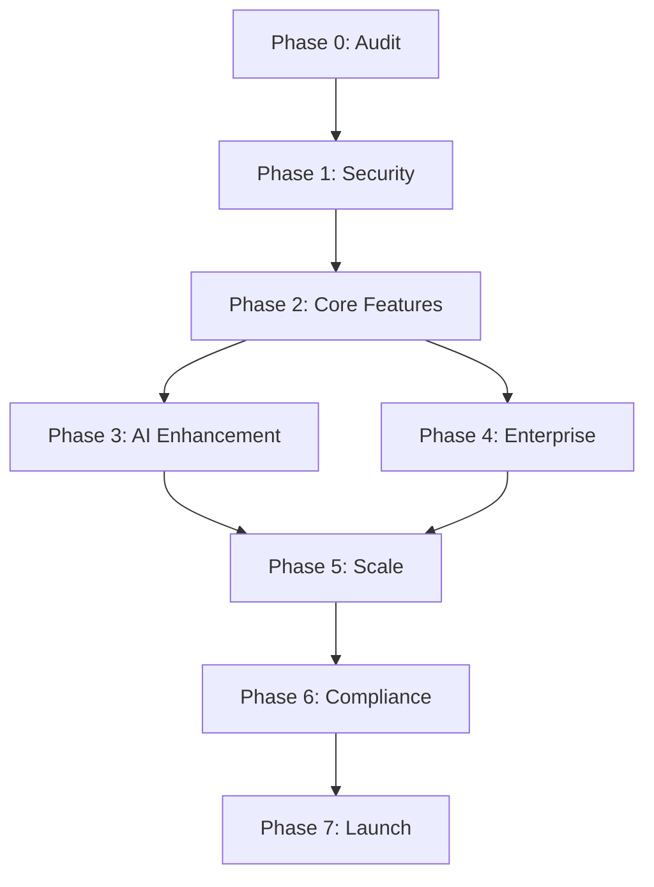

# Comprehensive Development Roadmap - Benefits AI Platform

**Version:** 2.0  
**Date:** 2025-08-05  
**Timeline:** 24 Weeks (6 Months)  
**Status:** Zero-Gap Implementation Plan

## Executive Summary

This roadmap provides a complete, zero-gap implementation plan for the Benefits AI Platform, ensuring all critical features are delivered with proper testing, security, and compliance measures. The plan is structured in 8 phases with clear deliverables, success criteria, and gate reviews.

## Phase Overview

| Phase | Duration | Focus | Status |
|-------|----------|-------|---------|
| **Phase 0** | Weeks 1-2 | Discovery & Audit | ✅ Complete |
| **Phase 1** | Weeks 3-4 | Security & Auth Stabilization | 🔄 In Progress |
| **Phase 2** | Weeks 5-8 | Core Features Implementation | ⏳ Pending |
| **Phase 3** | Weeks 9-12 | RAG & AI Enhancement | ⏳ Pending |
| **Phase 4** | Weeks 13-16 | Enterprise Features | ⏳ Pending |
| **Phase 5** | Weeks 17-20 | Scale & Performance | ⏳ Pending |
| **Phase 6** | Weeks 21-22 | Compliance & Security | ⏳ Pending |
| **Phase 7** | Weeks 23-24 | Launch Preparation | ⏳ Pending |

## Phase 0: Discovery & Audit ✅ (Weeks 1-2) - COMPLETE

### Deliverables Completed
- ✅ Comprehensive codebase audit
- ✅ Dependency vulnerability analysis
- ✅ Stack Auth implementation review
- ✅ Technical debt documentation
- ✅ API endpoint mapping
- ✅ Security gap identification

### Key Findings
- 3 critical security issues identified
- 6 vulnerable dependencies documented
- Stack Auth configuration issues found
- Complete technical specification created

## Phase 1: Security & Auth Stabilization 🔄 (Weeks 3-4) - IN PROGRESS

### Week 3 Sprint
**Focus:** Critical Security Fixes

#### Tasks
- [ ] Fix unauthenticated admin endpoints
  - [ ] Add authentication to `/api/admin/cleanup-database`
  - [ ] Secure `/api/cron/process-documents` POST method
  - [ ] Implement `withAuth` middleware wrapper
- [ ] Resolve Stack Auth configuration
  - [ ] Unify project IDs across environments
  - [ ] Fix handler implementation pattern
  - [ ] Test auth flow in all environments
- [ ] Update vulnerable dependencies
  - [ ] Update React from RC to stable
  - [ ] Fix undici vulnerability
  - [ ] Update AI SDK packages from beta

#### Success Criteria
- Zero unauthenticated admin endpoints
- Consistent Stack Auth configuration
- All high/critical vulnerabilities resolved

### Week 4 Sprint
**Focus:** Authentication Hardening

#### Tasks
- [ ] Refactor middleware authorization
  - [ ] Implement role-based path protection
  - [ ] Add proper session validation
  - [ ] Create audit logging for access
- [ ] Implement API route protection pattern
  - [ ] Create reusable auth middleware
  - [ ] Apply to all admin routes
  - [ ] Add rate limiting middleware
- [ ] Add comprehensive auth tests
  - [ ] Unit tests for auth functions
  - [ ] Integration tests for auth flow
  - [ ] E2E tests for login/logout

#### Success Criteria
- 90% test coverage for auth code
- All API routes protected
- Middleware authorization working correctly

### Gate 1 Review
- [ ] Security audit passed
- [ ] All auth tests green
- [ ] No critical vulnerabilities
- [ ] Documentation updated

## Phase 2: Core Features Implementation (Weeks 5-8)

### Week 5-6 Sprint
**Focus:** RAG System Integration

#### Tasks
- [ ] Implement document processing pipeline
  - [ ] Document chunking algorithm
  - [ ] Embedding generation service
  - [ ] Pinecone integration
- [ ] Create `searchKnowledge` AI tool
  - [ ] Vector search implementation
  - [ ] Result ranking algorithm
  - [ ] Context building for LLM
- [ ] Add citation support
  - [ ] Source tracking in responses
  - [ ] Reference formatting
  - [ ] Document highlighting

#### Success Criteria
- Documents searchable via AI
- Accurate knowledge retrieval
- Citations in AI responses

### Week 7-8 Sprint
**Focus:** Benefits Management System

#### Tasks
- [ ] Build benefits CRUD operations
  - [ ] Admin interface for plans
  - [ ] API endpoints for benefits
  - [ ] Database schema updates
- [ ] Create enrollment workflow
  - [ ] Enrollment form UI
  - [ ] Eligibility checking
  - [ ] Confirmation process
- [ ] Implement cost calculator
  - [ ] Premium calculations
  - [ ] Coverage comparisons
  - [ ] Decision support tools

#### Success Criteria
- Complete benefits management
- Working enrollment process
- Accurate cost calculations

### Gate 2 Review
- [ ] RAG system functional
- [ ] Benefits features complete
- [ ] Integration tests passing
- [ ] User acceptance testing

## Phase 3: RAG & AI Enhancement (Weeks 9-12)

### Week 9-10 Sprint
**Focus:** AI Capabilities Expansion

#### Tasks
- [ ] Enhance AI tool framework
  - [ ] Add benefits comparison tool
  - [ ] Create enrollment assistant
  - [ ] Build FAQ generator
- [ ] Implement conversation memory
  - [ ] Context persistence
  - [ ] Multi-turn conversations
  - [ ] User preference learning
- [ ] Add multimodal support
  - [ ] PDF processing
  - [ ] Image OCR
  - [ ] Table extraction

#### Success Criteria
- Enhanced AI capabilities
- Improved conversation quality
- Document type support

### Week 11-12 Sprint
**Focus:** Analytics & Insights

#### Tasks
- [ ] Build analytics dashboard
  - [ ] Usage metrics collection
  - [ ] Real-time dashboards
  - [ ] Export functionality
- [ ] Implement conversation analytics
  - [ ] Topic extraction
  - [ ] Sentiment analysis
  - [ ] Quality metrics
- [ ] Create admin reporting
  - [ ] Company-level reports
  - [ ] Platform-wide analytics
  - [ ] Cost analysis tools

#### Success Criteria
- Complete analytics system
- Actionable insights available
- Performance metrics tracked

### Gate 3 Review
- [ ] AI features tested
- [ ] Analytics functional
- [ ] Performance benchmarks met
- [ ] Security review passed

## Phase 4: Enterprise Features (Weeks 13-16)

### Week 13-14 Sprint
**Focus:** Multi-Tenant Enhancements

#### Tasks
- [ ] Implement organization management
  - [ ] Company onboarding flow
  - [ ] Bulk user import
  - [ ] SSO integration prep
- [ ] Add white-label support
  - [ ] Custom branding options
  - [ ] Domain mapping
  - [ ] Theme customization
- [ ] Build API for integrations
  - [ ] REST API documentation
  - [ ] Webhook system
  - [ ] Rate limiting

#### Success Criteria
- Multi-tenant features complete
- White-label functionality
- Integration-ready APIs

### Week 15-16 Sprint
**Focus:** Advanced Admin Features

#### Tasks
- [ ] Create super admin portal
  - [ ] Cross-tenant management
  - [ ] System health monitoring
  - [ ] Usage analytics
- [ ] Implement billing system
  - [ ] Subscription management
  - [ ] Usage tracking
  - [ ] Invoice generation
- [ ] Add compliance tools
  - [ ] Audit log exports
  - [ ] Compliance reports
  - [ ] Data retention policies

#### Success Criteria
- Complete admin portal
- Billing system functional
- Compliance tools ready

### Gate 4 Review
- [ ] Enterprise features complete
- [ ] Integration tests passing
- [ ] Security audit passed
- [ ] Performance testing done

## Phase 5: Scale & Performance (Weeks 17-20)

### Week 17-18 Sprint
**Focus:** Performance Optimization

#### Tasks
- [ ] Implement caching strategy
  - [ ] Redis integration
  - [ ] Query optimization
  - [ ] CDN configuration
- [ ] Optimize database queries
  - [ ] Index optimization
  - [ ] Query analysis
  - [ ] Connection pooling
- [ ] Enhance AI performance
  - [ ] Response streaming
  - [ ] Embedding cache
  - [ ] Model optimization

#### Success Criteria
- < 200ms API response time
- < 3s page load time
- 10x current load capacity

### Week 19-20 Sprint
**Focus:** Reliability & Monitoring

#### Tasks
- [ ] Implement monitoring
  - [ ] Error tracking (Sentry)
  - [ ] Performance monitoring
  - [ ] Custom dashboards
- [ ] Add resilience features
  - [ ] Circuit breakers
  - [ ] Retry logic
  - [ ] Graceful degradation
- [ ] Create runbooks
  - [ ] Incident response
  - [ ] Troubleshooting guides
  - [ ] Recovery procedures

#### Success Criteria
- 99.9% uptime capability
- Complete monitoring
- Documented procedures

### Gate 5 Review
- [ ] Performance targets met
- [ ] Load testing passed
- [ ] Monitoring operational
- [ ] Runbooks complete

## Phase 6: Compliance & Security (Weeks 21-22)

### Week 21 Sprint
**Focus:** Security Hardening

#### Tasks
- [ ] Conduct security audit
  - [ ] Penetration testing
  - [ ] OWASP compliance
  - [ ] Vulnerability scan
- [ ] Implement security features
  - [ ] 2FA support
  - [ ] Session management
  - [ ] IP whitelisting
- [ ] Update security docs
  - [ ] Security policies
  - [ ] Incident response
  - [ ] User guidelines

#### Success Criteria
- Security audit passed
- No critical vulnerabilities
- Documentation complete

### Week 22 Sprint
**Focus:** Compliance Preparation

#### Tasks
- [ ] HIPAA compliance
  - [ ] BAA agreements
  - [ ] Encryption verification
  - [ ] Access controls audit
- [ ] SOC 2 preparation
  - [ ] Control implementation
  - [ ] Evidence collection
  - [ ] Policy documentation
- [ ] Privacy compliance
  - [ ] GDPR readiness
  - [ ] CCPA compliance
  - [ ] Privacy controls

#### Success Criteria
- HIPAA compliant
- SOC 2 ready
- Privacy controls implemented

### Gate 6 Review
- [ ] Security audit passed
- [ ] Compliance verified
- [ ] Documentation complete
- [ ] Legal approval

## Phase 7: Launch Preparation (Weeks 23-24)

### Week 23 Sprint
**Focus:** Final Testing & Polish

#### Tasks
- [ ] End-to-end testing
  - [ ] User journey tests
  - [ ] Cross-browser testing
  - [ ] Mobile responsiveness
- [ ] Performance testing
  - [ ] Load testing
  - [ ] Stress testing
  - [ ] Failover testing
- [ ] Final bug fixes
  - [ ] Critical bug resolution
  - [ ] UI/UX polish
  - [ ] Copy review

#### Success Criteria
- All tests passing
- Zero critical bugs
- Performance validated

### Week 24 Sprint
**Focus:** Go-Live Preparation

#### Tasks
- [ ] Production deployment
  - [ ] Environment setup
  - [ ] Data migration
  - [ ] DNS configuration
- [ ] Launch materials
  - [ ] User documentation
  - [ ] Training materials
  - [ ] Marketing assets
- [ ] Support preparation
  - [ ] Support team training
  - [ ] FAQ documentation
  - [ ] Escalation procedures

#### Success Criteria
- Production deployed
- Documentation complete
- Support team ready

### Gate 7 Review
- [ ] Production readiness confirmed
- [ ] All systems operational
- [ ] Launch plan approved
- [ ] Stakeholder sign-off

## Critical Path Dependencies

## Resource Requirements

### Development Team
- **Backend Engineers:** 3 FTE
- **Frontend Engineers:** 2 FTE
- **AI/ML Engineer:** 1 FTE
- **DevOps Engineer:** 1 FTE
- **QA Engineer:** 1 FTE
- **Product Manager:** 1 FTE
- **UI/UX Designer:** 0.5 FTE

### Infrastructure Costs (Monthly)
- **Vercel Pro:** $250
- **Neon Database:** $500
- **Pinecone:** $300
- **AI APIs:** $2,000
- **Monitoring:** $200
- **Total:** ~$3,250/month

## Risk Mitigation

### Technical Risks
| Risk | Impact | Mitigation |
|------|--------|------------|
| AI accuracy issues | High | Extensive testing, human review |
| Scale limitations | Medium | Early load testing, optimization |
| Integration failures | Medium | Thorough API testing, fallbacks |
| Security breaches | High | Regular audits, best practices |

### Business Risks
| Risk | Impact | Mitigation |
|------|--------|------------|
| Delayed launch | High | Buffer time, parallel work streams |
| Budget overrun | Medium | Regular reviews, cost monitoring |
| Low adoption | High | User testing, iterative improvement |
| Compliance issues | High | Early legal review, expert consultation |

## Success Metrics

### Technical Metrics
- **Test Coverage:** > 80%
- **Build Success Rate:** > 99%
- **API Response Time:** < 200ms p95
- **Uptime:** > 99.9%
- **Error Rate:** < 0.1%

### Business Metrics
- **User Activation:** > 80%
- **Daily Active Users:** > 60%
- **AI Accuracy:** > 95%
- **Support Tickets:** < 5% of users
- **NPS Score:** > 50

### Launch Criteria
1. All phases complete with gate approvals
2. Security audit passed
3. Performance targets met
4. Compliance verified
5. Documentation complete
6. Support team trained
7. Stakeholder approval

## Communication Plan

### Weekly Updates
- Development progress
- Blockers and risks
- Metric tracking
- Budget status

### Phase Gates
- Formal review meetings
- Go/no-go decisions
- Stakeholder presentations
- Risk assessments

### Launch Communications
- Internal announcement
- Customer notifications
- Press release
- Training sessions

## Post-Launch Roadmap

### Month 1
- Monitor system stability
- Gather user feedback
- Fix critical issues
- Optimize performance

### Month 2-3
- Feature enhancements
- Integration expansions
- Mobile app development
- International expansion

### Month 4-6
- Advanced AI features
- Industry specializations
- Partner integrations
- Scale optimizations

## Conclusion

This comprehensive roadmap ensures zero gaps in the development process, with clear phases, deliverables, and success criteria. The plan addresses all technical debt, implements proper security measures, and builds a scalable platform ready for enterprise deployment. With proper execution and resource allocation, the Benefits AI Platform will be ready for production launch in 24 weeks.