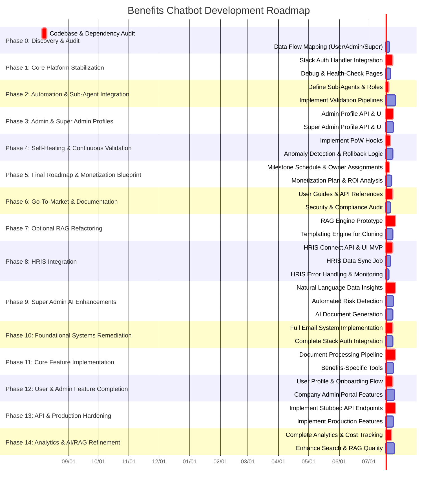

# Development Roadmap: Phases 0–7

This roadmap outlines each phase, tasks, owners, and estimated timelines for the Benefits Chatbot project.

**Owners:**
- **Team Lead:** @spencerpro
- **DataAgent:** @data-engineer
- **AuthAgent:** @auth-specialist
- **QAAgent:** @qa-engineer
- **DeploymentAgent:** @devops-engineer

**Gate Criteria:** Refer to `claude.md` Phase Gating Strategy section for each gate approval requirements.
